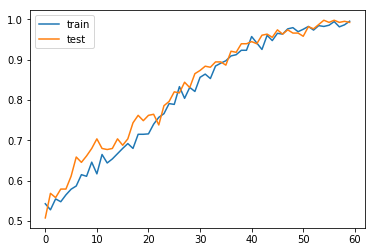

# Daily-News-for-Stock-Market-Prediction
Dataset from https://www.kaggle.com/aaron7sun/stocknews


```python
!unzip stocknews.zip
```

    Archive:  stocknews.zip
      inflating: Combined_News_DJIA.csv  
      inflating: DJIA_table.csv          
      inflating: RedditNews.csv          


```python
import pandas as pd
import re
import math
import copy
import time
import torch.nn as nn
from torch.autograd import Variable
import torch.nn.functional as F
import torch
import numpy as np
import random
import matplotlib.pyplot as plt
from random import sample

!pip install bpemb
from bpemb import BPEmb

```

    Collecting bpemb
      Downloading https://files.pythonhosted.org/packages/bc/70/468a9652095b370f797ed37ff77e742b11565c6fd79eaeca5f2e50b164a7/bpemb-0.3.0-py3-none-any.whl
    Collecting sentencepiece (from bpemb)
    [?25l  Downloading https://files.pythonhosted.org/packages/14/3d/efb655a670b98f62ec32d66954e1109f403db4d937c50d779a75b9763a29/sentencepiece-0.1.83-cp36-cp36m-manylinux1_x86_64.whl (1.0MB)
         |████████████████████████████████| 1.0MB 14.3MB/s 
    [?25hRequirement already satisfied: requests in /usr/local/lib/python3.6/dist-packages (from bpemb) (2.21.0)
    Requirement already satisfied: gensim in /usr/local/lib/python3.6/dist-packages (from bpemb) (3.6.0)
    Requirement already satisfied: numpy in /usr/local/lib/python3.6/dist-packages (from bpemb) (1.16.5)
    Requirement already satisfied: tqdm in /usr/local/lib/python3.6/dist-packages (from bpemb) (4.28.1)
    Requirement already satisfied: urllib3<1.25,>=1.21.1 in /usr/local/lib/python3.6/dist-packages (from requests->bpemb) (1.24.3)
    Requirement already satisfied: idna<2.9,>=2.5 in /usr/local/lib/python3.6/dist-packages (from requests->bpemb) (2.8)
    Requirement already satisfied: certifi>=2017.4.17 in /usr/local/lib/python3.6/dist-packages (from requests->bpemb) (2019.6.16)
    Requirement already satisfied: chardet<3.1.0,>=3.0.2 in /usr/local/lib/python3.6/dist-packages (from requests->bpemb) (3.0.4)
    Requirement already satisfied: smart-open>=1.2.1 in /usr/local/lib/python3.6/dist-packages (from gensim->bpemb) (1.8.4)
    Requirement already satisfied: scipy>=0.18.1 in /usr/local/lib/python3.6/dist-packages (from gensim->bpemb) (1.3.1)
    Requirement already satisfied: six>=1.5.0 in /usr/local/lib/python3.6/dist-packages (from gensim->bpemb) (1.12.0)
    Requirement already satisfied: boto3 in /usr/local/lib/python3.6/dist-packages (from smart-open>=1.2.1->gensim->bpemb) (1.9.220)
    Requirement already satisfied: boto>=2.32 in /usr/local/lib/python3.6/dist-packages (from smart-open>=1.2.1->gensim->bpemb) (2.49.0)
    Requirement already satisfied: s3transfer<0.3.0,>=0.2.0 in /usr/local/lib/python3.6/dist-packages (from boto3->smart-open>=1.2.1->gensim->bpemb) (0.2.1)
    Requirement already satisfied: botocore<1.13.0,>=1.12.220 in /usr/local/lib/python3.6/dist-packages (from boto3->smart-open>=1.2.1->gensim->bpemb) (1.12.220)
    Requirement already satisfied: jmespath<1.0.0,>=0.7.1 in /usr/local/lib/python3.6/dist-packages (from boto3->smart-open>=1.2.1->gensim->bpemb) (0.9.4)
    Requirement already satisfied: docutils<0.16,>=0.10 in /usr/local/lib/python3.6/dist-packages (from botocore<1.13.0,>=1.12.220->boto3->smart-open>=1.2.1->gensim->bpemb) (0.15.2)
    Requirement already satisfied: python-dateutil<3.0.0,>=2.1; python_version >= "2.7" in /usr/local/lib/python3.6/dist-packages (from botocore<1.13.0,>=1.12.220->boto3->smart-open>=1.2.1->gensim->bpemb) (2.5.3)
    Installing collected packages: sentencepiece, bpemb
    Successfully installed bpemb-0.3.0 sentencepiece-0.1.83


#Data Preprocessing


```python
news_data = pd.read_csv("Combined_News_DJIA.csv")
news_data = news_data.fillna('')
news_data.isnull().sum(axis = 0)
news_headers = list(filter(lambda x: 'Top' in x, news_data.columns))
col = 'news'
news_data[col] = ""
for i in news_headers:
  news_data[col] += " " + news_data[i]
  

news_data[col] = [re.sub(r'\W', ' ', row) for row in news_data[col]]

news_data[col] = [re.sub(r'\n+', ' ', row) for row in news_data[col]]

news_data[col] = [re.sub(r'\t+', ' ', row) for row in news_data[col]]

news_data[col] = [re.sub(r'\s+[b]\s+', '', row) for row in news_data[col]]

news_data[col] = [re.sub(r'\s+', ' ', row, flags=re.I) for row in news_data[col]]

news_data[col] = [re.sub(r'^\s+', '', row, flags=re.I) for row in news_data[col]]

news_data[col] = [re.sub(r'^\n+', '', row, flags=re.I) for row in news_data[col]]

news_data[col] = [re.sub(r'^\t+', '', row, flags=re.I) for row in news_data[col]]

news_data[col] = [re.sub(r'^b\s+', '', row) for row in news_data[col]]

n_embedding_dims = 100
bpemb_en = BPEmb(lang="en", dim=n_embedding_dims)
```

    downloading https://nlp.h-its.org/bpemb/en/en.wiki.bpe.vs10000.model


    100%|██████████| 400869/400869 [00:00<00:00, 8894283.46B/s]
    100%|██████████| 3784656/3784656 [00:00<00:00, 41168714.99B/s]


    downloading https://nlp.h-its.org/bpemb/en/en.wiki.bpe.vs10000.d100.w2v.bin.tar.gz


    /usr/local/lib/python3.6/dist-packages/smart_open/smart_open_lib.py:398: UserWarning: This function is deprecated, use smart_open.open instead. See the migration notes for details: https://github.com/RaRe-Technologies/smart_open/blob/master/README.rst#migrating-to-the-new-open-function
      'See the migration notes for details: %s' % _MIGRATION_NOTES_URL


```python
class RNNLSTM(nn.Module):
    def __init__(self, input_size, hidden_size):
        super(RNNLSTM, self).__init__()
        self.hidden_size = hidden_size
        self.i2h = nn.LSTMCell(input_size, hidden_size).to(device)
        
    def forward(self, input, hidden, cell):
        hidden, cell = self.i2h(input, (hidden, cell))
        return hidden, cell

    def initHidden(self):
        return torch.zeros(1, self.hidden_size, device = device)
    def initCell(self):
        return torch.zeros(1, self.hidden_size, device = device)      
      
class Classifier(nn.Module):
    def __init__(self, hidden_size, output_size):
        super(Classifier, self).__init__()
        self.hidden_size = hidden_size
        self.h2o = nn.Linear(hidden_size, output_size).to(device)
        self.softmax = nn.LogSoftmax(dim=1)

    def forward(self, hidden):
        hidden = self.h2o(hidden)
        output = self.softmax(hidden)
        return output
```


```python
def random_row_to_tensor(data):
    row = news_data.sample(n=1)
    line = row['news'].values.tolist()[0]
    embedding = bpemb_en.embed(line)
    embedding = np.reshape(embedding,(embedding.shape[0],1,embedding.shape[1]))
    label = row['Label'].values.tolist()[0]
    label_tensor = torch.tensor([label], dtype=torch.long, device=device)
    claim_tensor = torch.tensor(embedding, dtype=torch.float, device=device)
    return claim_tensor, label_tensor, line, label

def row_to_tensor(row):
    line = row['news']
    embedding = bpemb_en.embed(line)
    embedding = np.reshape(embedding,(embedding.shape[0],1,embedding.shape[1]))
    label = row['Label']
    label_tensor = torch.tensor([label], dtype=torch.long, device=device)
    claim_tensor = torch.tensor(embedding, dtype=torch.float, device=device)
    return claim_tensor, label_tensor, line, label  
def timeSince(since):
    now = time.time()
    s = now - since
    m = math.floor(s / 60)
    s -= m * 60
    return '%dm %ds' % (m, s)
  
```


```python
def train(category_tensor, line_tensor, update=True):
    rnnOptimizer.zero_grad()
    classifierOptimizer.zero_grad()

    hidden = rnn.initHidden()
    cell = rnn.initCell()
    for i in range(line_tensor.size()[0]):
        hidden, cell = rnn(line_tensor[i], hidden, cell)
    output = classifier(hidden)
    loss = criterion(output, category_tensor)
    if update:
      loss.backward()
      rnnOptimizer.step()
      classifierOptimizer.step()        
    return output, loss.item()
  
def test(test_data):   
  test_accuracy = 0
  for index, row in test_data.iterrows():      
      test_line_tensor, test_category_tensor, test_line, test_category = row_to_tensor(row)
      test_output, test_loss = train(test_category_tensor, test_line_tensor, update=False)
      top_test_value, top_test_index = test_output.topk(1)
      test_guess_category = top_test_index[0].item()
      test_accuracy += 1 if test_guess_category == test_category else 0
  return test_accuracy / len(test_data)
```


```python
train_data = news_data[news_data['Date'] < '2015-01-01']
test_data = news_data[news_data['Date'] > '2014-12-31']
print(f'train data size = {len(train_data)}')
print(f'test data size = {len(test_data)}')
device = torch.device("cuda" if torch.cuda.is_available() else "cpu")
n_hidden = 128
n_categories = 2
rnn = RNNLSTM(n_embedding_dims, n_hidden).to(device)
classifier = Classifier(n_hidden, n_categories).to(device)

criterion = nn.NLLLoss()
learning_rate = 1e-4
rnnOptimizer = torch.optim.Adam(rnn.parameters(), lr=learning_rate)
classifierOptimizer = torch.optim.Adam(classifier.parameters(), lr=learning_rate)

n_iters = 60000
plot_every = 1000

# Keep track of losses for plotting
current_loss = 0
all_losses = []

start = time.time()

train_cumulative_loss = 0
average_train_accuracy = 0
all_train_losses = []
all_train_accuracies = []
all_test_accuracies = []

count = 0
for iter in range(1, n_iters + 1):  
    train_line_tensor, train_category_tensor, train_line, train_category = random_row_to_tensor(train_data)
    train_output, train_loss = train(train_category_tensor, train_line_tensor)    
    top_train_value, top_train_index = train_output.topk(1)
    train_guess_category = top_train_index[0].item()
    train_cumulative_loss += train_loss
    train_accuracy = 1 if train_guess_category == train_category else 0
    average_train_accuracy = (average_train_accuracy * count + train_accuracy) / (count+1)

    count += 1

    if iter % plot_every == 0:
        train_correct = '✓' if train_guess_category == train_category else '✗ (%s)' % train_category
        print('Train: %d  %d%% (%s) average_accuracy=%.4f average_loss=%.4f %s / %s %s' % (iter, iter / n_iters * 100, timeSince(start), average_train_accuracy, train_cumulative_loss / plot_every, train_line, train_guess_category, train_correct))
        all_train_losses.append(train_cumulative_loss / plot_every)
        all_train_accuracies.append(average_train_accuracy) 
        all_test_accuracies.append(test(test_data))
        train_cumulative_loss = 0
        average_train_accuracy = 0              
        count = 0        

```

    train data size = 1611
    test data size = 378
    Train: 1000  1% (1m 54s) average_accuracy=0.5430 average_loss=0.6877 Azerbaijan accidentally released election results before voting had even started It showed President Ilham Aliyev winning 73 to the opposition s 7 China warns US to stop manufacturing crises and raise debt ceiling China criticises mind boggling political infighting over issue of raising America s 16 7 trillion debt ceiling A farmer commits suicide every two days in France almost 500 in three years Armed rebels kidnap Libya s prime minister William Binney is a man on a mission He spent nearly 30 years as a top executive in America s super secret National Security Agency NSA now he wants you to know that same spy agency is pushing western democracies including Canada toward fascism Girl slain after alerting police about stalker Indigenous Woman Gives Birth On Hospital Lawn In Mexico After Doctors Denied Her Care Four U S whistleblowers who have met with former National Security Agency systems analyst Edward Snowden say he is settling into life in Russia and expresses no regrets about leaking highly classified information Girls in Pakistan see Taliban victim Malala as heroine I am not sure my son will be returning to the U S again Edward Snowden s Father while Speaking to Russian Press Reporters in Moscow Israel demands Yatta villagers remove solar panels China Passes U S As World s Biggest Oil Importer Molotovs tear gas and a burning bus The Black Bloc join Rio teacher protest One local resident couldnt believe what he was seeing He turned to me and said Theres got to be another way US press freedom Journalists complain about the climate of fear under Obama Government turns unable to seize Bitcoins Spanish schoolkids fainting from hunger due to government spending cuts EU Human Rights boss Azerbaijan President Ilham Aliyev wins third term opposition claims fraud Turkey Cracks Down on Cleavage As dolphin die off nears record high shutdown puts investigation on ice Pakistan s Malala Yousafzai wins EU human rights prize No one at Fukushima seems to have any idea what theyre doing London Police Order Registrars To Shut Down A Bunch Of Websites Without Any Legal Basis Threaten Registrars If They Don t Comply Canadian Alice Munro receives Nobel Prize in litterature Kidnapped Libyan PM Ali Zeidan released A team of Japanese researchers has developed a compound to suppress the formation of a protein believed to cause Alzheimers disease according to a study published Wednesday in a British science journal  / 1 ✓
    Train: 2000  3% (4m 5s) average_accuracy=0.5280 average_loss=0.6897 Dear FSM this is fucking terrible sadSordid reality behind Dubai s gilded facade Construction halted westerners jailed for adultery but prostitutes do wellTourists warned of Thailand airport scamAriel Sharon got on Israeli radio and urged Israelis to settle more land fast Grab the hilltops and stake your claim he said Everything we don t grab will go to themThe high cost of discount counterfeits In a sweatshop in Thailand children were found assembling leather purses Horrifyingly their limbs had been deliberately broken to keep them from escapingBosnian Serb cousins convicted of burning 119 Muslims aliveWhat democracy looks like Not that I like those Taliban chaps but dude I think you re doing it wrongJuly bloodiest month for US led troops What are we really doing in Afghanistan can anyone give me a reasonwhile Nazi leader Adolf Hitler operated from headquarters encased in layers of concrete Churchill and his staff were sleeping in rooms only 10 feet below groundThe Onion has been sold to the Chinese GovernmentLast Friday the Chinese government confiscated the computers of lawyers at the Open Constitution Initiative best known for its pro bono work on behalf of the victims of last year s tainted milk scandalFrench Interior Ministry requests news blackout as violence in the suburbs reaches record levelsIran s supreme leader warns Iran s elite to back downPoll Pirates close in on Riksdag Pirate Party gaining traction in SwedenThe terrorist threat to the UK has been lowered from severe to substantial the lowest level for three yearsQuestioning the Good War Is Obama s Afghan strategy realisticDear reddit The recession was not caused by a spectacular failure of capitalism or economics Just though you should knowBill outlawing anti Israel protest nears approval nThe Neo Nazis of Mongolia Swastikas Against ChinaOf more concern to South Korea is the kidnapping by North Korea of one of its businessmen in March North Korea claims that the man identified only as Mr Yu tried to lure a North Korean female worker to the south and insulted the North Korean regime259 Car Autobahn Pile Up Largest In German History with videoA US military review is to recommend an overhaul of the entire Afghan prison and judicial systemsVatican launches inquiry into abusive religious orderOrthodox Jews riot as mother is accused of starving her child Times OnlineMassive motorway crash in Germany  / 1 ✓
    Train: 3000  5% (6m 19s) average_accuracy=0.5550 average_loss=0.6831 The solar system appears to have a new ninth planet Today two scientists announced evidence that a body nearly the size of Neptunebut as yet unseenorbits the sun every 15 000 years Less than 1 of the wealth created since 2000 has gone to the poorest 50 of the world s population new research has revealed Over half of the world s supply of Cobalt a primary element used in lithium batteries is mined in the Democratic Republic of Congo by child miners UK inquiry finds Putin probably approved Litvinenko assassination in 2006 Head transplant has been successfully done on a monkey Tajikistan shaves 13 000 men s beards to end radicalism Russia s currency collapses to lowest level ever China busts child trafficking ring recovers 15 infants Xinhua Two brothers hunting for ichthyosaur fossils along the coast of the United Kingdom came across something far more astounding The bones of what may be the earliest known dinosaur from the Jurassic period in the U K and possibly even the world a new study finds Saudi Arabia Minister Avoids Questions On Acquiring Nukes From Pakistan China to allocate 4 6 bln to shut 4 300 coal mines Denmark considers moving migrants to camps outside cities Afghanistan is setting up its first ever women only university in Kabul US wasted millions on Afghan reconstruction says watchdog 1 175 rhinos killed by poachers in S Africa last year Fewer than 100 rhinos were poached in 2008 since when numbers have rocketed Jimmy Savile raped children as young as nine while working at BBC leaked report finds People are afraid these zombie ships are the first sign of global economic collapse Fears grow of repeat of 2008 financial crash as investors run for cover Vietnam is mourning an ancient turtle revered as a symbol of auspiciousness whose death has shocked the country Thought to be one of only four living Yangtze giant softshell turtles it was found floating in the Hanoi lake where it lived Cause of death is unclear Austria Limits Asylum to 1 5 Percent of Population Oil price fall to 10 a barrel not impossible admits BP boss A New U K Law Says Non E U Migrants Must Earn 35 000 or Face Deportation IMF recommends paying refugees below the minimum wage Sierra Leone Records Another Ebola Case Days After Africa Was Declared Ebola Free Merkel says Austrian cap on refugees not helpful for European solution / 0 ✓
    Train: 4000  6% (8m 31s) average_accuracy=0.5480 average_loss=0.6831 Blair acknowledged that Israel was part of the equation on invading Iraq and that the Israeli government was being actively consulted in the planning for the warStudents interrupted Israel ambassador s lecture at Irving University in LA over 10 times shouting killers and how many Palestinians did you kill 12 arrestedGoldman Sachs helped the Greek government to mask the true extent of its deficit with the help of a derivatives deal that legally circumvented the EU Maastricht deficit rules At some point the so called cross currency swaps will mature and swell the country s already bloated deficitShame and Fear Inside Germany s Catholic Sexual Abuse Scandal Close to 100 priests and members of the laity have been suspected of abuse in recent years After years of suppression the wall of silence appears to be crumblingVictorian Time Capsule Found in BritainHaitian man found alive in rubble 4 weeks after earthquakeSaudi girl 12 wants to divorce husband 80Cows now outnumber humans in New Zealand This sucks Sheep jokes were much funnierChina jails activist who investigated deaths of children in schools destroyed by Sichuan earthquakeWhen it Rains it Pours Toyota Recalls 437K More Worldwide This Time Over Brake System Software FailureBlair used Soviet style propaganda nFrench govt accused British PM of propaganda in run up to Iraq warIran has asked the UN nuclear agency to oversee it s uranium enrichmentShow off French philosopher BHL is a laughing stock after citing spoof fictional philosopherIn its attempt to fool regulators the company is understood to have developed software that would display acceptable looking readouts on screens whenever inspectors from the Transport Ministry came to observe the testing procedures Good job developerIndian Government not to allow cultivation of genetically modified Brinjal for nowChina sentences earthquake activist to five years in prison for alleged email comments about the 1989 Tiananmen Square crackdownItaly says dozens of members of Iran s hardline religious Basij militia have tried to attack its embassy in Tehran but Iranian media described the incident as a student protest and did not mention any violenceSupreme leader Ayatollah Ali Khamenei said on Monday that Iran is set to deliver a punch that will stun world powers this weekSupporters of the Iranian Government attacked the Italian Embassy Death to Italy Death to BerlusconiVenezuela Electricity emergency declared by President Chavez while inaugurating his new radio talk showSlippery Jack Straw leaves Iraq Inquiry grasping for answersIran FM Israel is a crazy country run by crazy peopleItaly said dozens of members of Iran s hardline religious Basij militia had tried to attack its embassy in Tehran on Tuesday but Iranian media described the incident as a student protest and did not mention any violenceHugo Chvez s new radio show will not appear on any listings and will pounce without warning day or night on to the airwaves first a harp playing folk music then a familiar voiceObama considered labeling the Christmas Bomber as an Enemy Combatant  / 1 ✗ (0)
    Train: 5000  8% (10m 43s) average_accuracy=0.5650 average_loss=0.6756 Not Even in South ParkWTF CNN Compare CNN to real world news with this new mashupIsrael transferring people from West Bank to Gaza splitting families and disregarding international lawAmateur model known as Katya revealed as Russian honeytrap baitRussias President Dmitry Medvedev has ordered Soviet files concerning the massacre of some 22 000 Polish officers intellectuals and priests in the Katyn woods to be openedRoutine torture including electric shocks and sexual abuse was inflicted on detainees held in a secret prison in BaghdadGerman tabloids campaign for Greece to leave the euroIsrael has given itself the right to forcefully move Palestinians out of the West Bank who don t have a permit Permit is not defined at all it can be anything the person in charge wants it to be This is setting precedent to force thousands of Palestinians to move to GazaPrime Minister Gordon Brown has been caught on microphone describing a voter he had just spoken to in Rochdale as a bigoted womanIt would impossible to reveal secret MI5 files about the 7 7 London terror attacks a court has been toldOkinawans say the U S military has been responsible r nfor a number of blights in Okinawa from serious r ncrimes like rape and drunken driving to r nenvironmental and noise pollutionRating Agencies Strike Again First they were off about how good U S mortgage securities were Now they re causing havoc in the EU by downgrading the bond ratings of several countriesIreland s bombed head shops spark debate over Irish drug policyShell profits surge by 49 always great to hear big oil doing so wellGreece infection spreads as stricken nations debt is rated junkEU on the edge of the abyss If the Greek crisis is not addressed Portugal will come under intense pressure contagion might then spread to Ireland Italy or Spain the other euro area countries with some mixture of big budget deficits poor growth prospects and high debtsGreece might need up to 120 Billion Euros according to German parliamentariansIsraeli Law Enforcement Cracks Down on Alleged Political Corruption Former Israeli Prime Minister Ehud Olmert could be sent to prison if he is convicted in a high profile corruption trialSuntanned women to be arrested under Islamic dress codeFreedom of the press in Turkey further under r nattack Journalist faces prison threat for reporting r non judiciary crisis in TurkeyLawmakers in Ukraine scuffled with each other throwing punches and eggs as parliament met Tuesday to ratify a treaty with Russia that extends the latter s navy presence in the Ukraine s Crimean peninsula until 2042The Argentinian Supreme Court overturned pardons of a dictatorship era president and economy minister paving the way for them to be tried for kidnapping and extortionKim Jong Ils new plan may be to attack and occupy SeoulGreece bans short selling as panic spreads Shares tumble across Britain Europe and Asia after the cost of insuring Greek debt against default hits a 14 year highA US Coast Guard official says if leaks from an oil well in the Gulf of Mexico are not stemmed soon they could cause one of the worst spills in US history  / 1 ✓
    Train: 6000  10% (12m 53s) average_accuracy=0.5790 average_loss=0.6736 RIP Brenden Foster the 11 year old whose last wish was to feed the homelessGeorgian ambassador admits that they started itHow Canada honours our war dead sends shivers down my spine seeing it in person is beyond breathtakingTurns out Indian Navy actually sank Thai fishing boat not pirate mothership EmbarassingMumbai under attack Bomb blast and firefights in South Mumbai Blasts and gun flights in Oberoi Taj and Trident Hotels A lot of Chaos nothing is clear at the momentSouth Africa President Mbekis denial of the well established scientific consensus about the viral cause of AIDS and the essential role of antiretroviral drugs led to the death of 365 000 peoplePirate Boat Indian Navy Sank Was Thai TrawlerMumbai rocked by deadly shootingsEvidence Suggests British Liquid Bomb Plot was Directed by UK Pakistan US IntelligenceGreenland votes for self ruleDivers Find Ammunition on Lusitania so much for innocent passanger shipQuixtar and Amway are scams Spread the wordFollowing in China s footsteps US baby formula manufacturers add melamineMumbai attacked by terrorists3 000 dead from cholera in Zimbabwe Local Government takes action to conceal the scale of this deadly epidemicOne third of China s Yellow River is Heavily Polluted with Industrial DischargeEverest and Himalayan Glaciers Could Vanish By 2035 Imperiling a Billion PeopleAfghan President Hamid Karzai said Wednesday he would bring down U S planes bombing villages if he couldChinese villege may have Roman Ancestry unusual numbers of western faces among chinese brethrenMuslim clerics cancel fatwa against yogaMan Who Killed 6 Cops with a Knife is ExecutedThai crisis exposes class strugglePalestinian Children Teargassed Protesting Annexation WallOfficial Russians want to search for oil off CubaIntimidation and murder in Coca Colas Colombian factories  / 0 ✗ (1)
    Train: 7000  11% (15m 5s) average_accuracy=0.5870 average_loss=0.6617 Norway Has More Money Than It Knows What To Do With Our biggest challenge is that our oil wealth is so huge we run the risk of wasting it on substandard projects that are not profitable enough Obama s top aide We lack irrefutable beyond a reasonable doubt evidence on Syria A 58 year old Uruguayan man who disappeared four months ago in the remote Andes Mountains was found alive on Sunday after he spent a brutal winter eating rats and raisins to survive local media reported Why Dubai s Islamic Austerity is a Sham Couples who publicaly kiss are jailed yet the state turns a blind eye to 30 000 imported prostitutes Obama Administration Denies AP Requests For Syria Evidence Saddam used chemical weapons on Iran with no hullabaloo from the West Ex British Foreign Secretary Russia urges Assad to give up chemical weapons France strengthens separation of Church and State by unveiling a charter of 15 rules to uphold secularism that will be displayed in every school in the country Obama Is Going To Struggle To Even Get 100 Syria Votes in The House First Detection of Water Ice on Saturn by Cassini Spacecraft Al Nusra Front Rebels Start Killing Syrian Christians After Retaking Village From Government Forces The Chinese dissident whom Yahoo helped put in prison eight years ago is finally a free man Fantastico to reveal latest Snowden leak US government spied on Brazilian oil giant Petrobas Syria chemical weapons attack not ordered by Assad says German secret service ATMs that allow you to exchange cash for Bitcoins coming to Canada this fall 5 Bitcoin kiosks similar to ATMs are coming to Canada with the first machine expected to land in Vancouver in early October Assad Tells PBS Charlie Rose Syria Prepared to Retaliate if Hit The U S government tapped into computer networks of companies including Google Inc and Brazilian state run oil firm Petroleo Brasileiro SA according to leaked U S documents Sudanese woman Amira Osman Hamed refuses to cover her head faces flogging Afghan authorities slam NATO after drone strike kills 16 civilians Public concerned over growing use of Tasers by police in UK US planning three days of Syria attacks Al Qaida fighters among rebels who seize Christian village in Syria German intelligence indicates Syrian government forces may have carried out a chemical weapons attack without the permission of President Assad Confidential documents have revealed the formidable lobbying operation waged by tobacco giant Philip Morris seeking to undermine efforts to make cigarettes less attractive to children and women and force packs to carry larger health warnings Russia to push Syria to surrender chemical weapons / 0 ✗ (1)
    Train: 8000  13% (17m 16s) average_accuracy=0.6150 average_loss=0.6567 Japanese police say people have returned 78 million in missing cash after quake The fact that a hefty 2 3 billion yen in cash has been returned to its owners shows the high level of ethical awareness in the Japanese people Spanish Police Brutality they hit a girl in her face then they hit the photographer who watched it video Tent Collapsed By Storm Six Die At Pukkelpop Festival in Belgium Julia Tymosjenko suddenly falls victim to mysterious disease just like the last head of the political opposition in Ukraine For the first time a spacecraft far from Earth has turned and watched a solar storm engulf our planet The movie sent chills down my spine says Craig DeForest of the Southwest Research Institute in Boulder Colorado Study shows powerful corporations really do control the world s finances Civilians shot dead at Syria protests At least 22 people reportedly killed after UN claims government may be guilty of crimes against humanity Reindeer herder finds remains of baby mammoth in Russia s Arctic Over 50 killed as suicide bomber explodes in Pakistan mosque FOUR Stages Collapse at Pukkelpop Festival in Belgium 6 4 and 6 2 Earthquakes hit Japan Israel plane kills three Egyptian police near border Venezuelan President Hugo Chvez announced plans to nationalize the country s gold mining industry and withdraw 11B in gold reserves from U S and European banks Vietnam s prime minister has put the country on alert as an outbreak of hand foot amp mouth disease continues to surge killing 81 children amp sickening over 32 000 people nationwide so far this year Chile officially recognized 9 800 more Pinochet victims increasing the total number of people killed tortured or imprisoned for political reasons to 40 018 OPEC states that Venezuela has worlds largest oil reserves England rioters young poor and unemployed Syrian forces kill 20 despite Assad pledge Egypt protests to Israel over police deaths following Sinai retaliation Egypt filed an official complaint with Israel following yesterday s deaths at the border between Israel and Egypt Russia once almost a democracy Today Vladimir Putin presides over an authoritarian government in the Russian White House a bulky 20 story skyscraper on the edge of the Moscow River Occasional demonstrations in favor of democracy are small and largely ignored except by the police Egyptians Defend Viral Video Activist Charged in Military Court Asmaa Mahfouz is facing prosecution for speaking out again Presidential candidates NGOs amp ordinary Egyptians are rallying to her defense amp decrying the use of military trials for civilians Magnitude 6 8 quake jolts Japan off Fukushima tsunami advisory Reuters New schools in Pakistan are attempting to de radicalize captured Taliban members Zimbabwe Farm Invasions Continue Across Country The remaining white commercial farmers across the country are facing intensified threats by mobs of land invaders as the lawless invasions of farms continue Prison or Rape  / 1 ✗ (0)
    Train: 9000  15% (19m 27s) average_accuracy=0.6110 average_loss=0.6599 Donald Trump loses Scottish windfarm appeal North Korea sentences Canadian pastor to hard labor for life Brazil downgraded to junk status by 2nd risk agency with negative outlook for further downgrades No regime change in Syria After talks in Moscow Kerry accepts Russian stance on Assad A moderate Muslim group says that a Singapores Penal Code section which covers actions done with deliberate intent to wound the religious or racial feelings of any person curbs freedoms in Singapore and contradicts with secularism Members of Qatari Ruling Family Kidnapped in Iraq While Hunting Report Arctic temperatures hit record high November was Earths warmest such month on record by a huge margin 1 05 degrees Celsius or about 1 9 degrees Fahrenheit warmer than the 1951 to 1980 average Its also the second month in a row that Earths temperature exceeded 1 degree Celsius above average Taliban Join Global Effort to Kill Off Polio in 2016 Hamas political leader Stabbers are the most exalted noblest of people Iran seizes more than 40 000 cars over womens veil offenses Iran violated a U N Security Council resolution in October by test firing a missile capable of delivering a nuclear warhead a team of sanctions monitors said leading to calls in the U S Congress on Tuesday for more sanctions on Tehran After the Syrian Kurds failed to receive an invitation to the Syrian opposition conference in Riyadh Russia s Deputy Foreign Minister has stated that Russia is against excluding the Kurds from the Syrian peace negotiations Two teams of physicists working independently at the Large Hadron Collider at CERN the European Organization for Nuclear Research reported on Tuesday that they had seen traces of what could be a new fundamental particle of nature China is continuing to commandeer islands in the South China Sea Two Palestinians on trial in Germany for targeting Israeli embassy European teenagers face having to secure parental permission to join the likes of Facebook Instagram and Snapchat before the age of 16 under new EU data protection proposals Global supermarkets selling shrimp peeled by slaves More than 2 000 trapped fishermen have been freed this year as a result of an ongoing Associated Press investigative series into slavery in the Thai seafood industry Hamas Jerusalem car ramming terrorist was a member Revealed Rupert Murdoch and top News Corp bosses meetings with government ministers US Not Seeking Regime Change in Syria John Kerry Says After Meeting With Russian President Germany armored truck robbed by group using anti tank rocket launcher and automatic weapons Police still searching for suspects Germany makes Facebook Google and Twitter remove hate speech within 24 hours Peru is planning to sanction Kimberly Clark for allegedly conspiring with a competitor to set prices for toilet paper and other products Pope Francis is urging governments to consider granting a Holy Year amnesty to prisoners find alternatives to incarceration and at the very least abolish the death penalty in his annual peace message released Tuesday  / 0 ✗ (1)
    Train: 10000  16% (21m 38s) average_accuracy=0.6460 average_loss=0.6412 We had some Australians they stayed here for four days They would take turns sleeping and the only time they left was to go to the ATM World s First Cocaine Bar in BoliviaBill Clinton s visit to North Korea revealed more about the nation than intelligence has been able to uncover for decadesAt least 95 people were killed and 563 wounded in a series of truck bombings and other attacks on Wednesday that rocked areas around official buildings in central BaghdadDawkins calls for official apology for Alan Turing the code breaking genius and father of the modern computer who committed suicide after being prosecuted for being gay nUK defends NHS against stateside attacks vidChinese scientist with Stanford PhD now drives a taxiIt may make great headlines but to my mind this is child abuse and irresponsible parenting And anyway what faith can you have in a father who changes his name to Happy birthdaySweden report shows that Apartheid Israel steal organs from Palestinian to Sell them later and make profit Israel respond Anti semiteThe Arctic Sea was carrying something not timber and not from Finland that necessitated some major work on the ship she wrote in the Moscow Times newspaper on WednesdayAleksei Etmanov s visit to Brazil he saw that the conditions of car workers there were significantly better than those on Russia He also saw how trade unionists participated in political struggleThey ask me if my mom wore a burka said Amri who is writing a book about Afghanistan s food and cultural heritage I tell them she wore a miniskirtWeapon mock ups loaded on the second Sukhoi Su 35 prototype on display at MAKS 2009 give an indication of the future air to surface weapons the aircraft could carry in Russian serviceIraq Islamists are conducting a campaign of torture and murder against men suspected of homosexual activityIsraelis Sour to Rahm Emanuel Once Attack r nDog Policy Wonk Committed Jew Now a Self Hating JewThey beat us if we raised our heads they beat us when they were getting us into the police carsBuran from space shuttle to fairground rideBuddhas Savage PeaceDivisions over Bahamas s marital rape bill Anti arguments are interestingIf you ve read the novel White Tiger Dharana is a village in the darkness In the darkness education barely exists sanitation is non existent and a light bulb is as high tech as it getsTheres a saying in Iceland now Oh thats so 2007 meaning that something is excessively grand over the top or just plain old splash a lot of cashIt s beginning to look a lot like the bad old days in Iraq Although the attacks were all confined to the capital and the north while the rest of the country remained relatively calm they demonstrated a degree of sophistication that U S officials thought the insurgents could no longer musterItalian banks may take ham and wine as collateralBookie pays out 2 mil on tiger to early and suffers for itA cable fault that caused a major blackout of internet services across West Africa has been repairedGaza s tunnel economy Eric Ruder looks at the lengths to which desperate Gazans starved and deprived by Israel s punishing blockade are going to in order to keep food and other necessities coming in  / 0 ✗ (1)
    Train: 11000  18% (23m 51s) average_accuracy=0.6170 average_loss=0.6430 NSA surveillance The US is behaving like China Both governments think they are doing what is best for the state and people But as I know such abuse of power can ruin lives By Ai Weiwei European member of parliament on PRISM We really need to wake up This is serious stuff The government knowing everything literally everything about us and we are unable to exercise any meaningful democratic scrutiny That is not a democracy Dutch intelligence has access to PRISM reveals existence of moles in companies Astronaut Chris Hadfield announces resignation Tony Blair There is a problem within Islam and we have to put it on the table and be honest about it It has at its heart a view of religion that is not compatible with pluralistic liberal open minded societies Turkey imprisons more journalists than any other country TransCanada Whistleblower says Oil Industry organized crime Chinese internet users call for an Edward Snowden of their own Chinese Internet users back Snowden call on government to protect him Google chief wrote about terrifying surveillance months before NSA leaks Turkish riot police move into Taksim Square live updates World news NSA builds its largest data farm Ever Daniel Ellsberg Edward Snowden Saving Us From the United Stasi of America Snowden s whistleblowing gives us a chance to roll back what is tantamount to an executive coup against the US constitution NSA Prism scandal Russia would consider Edward Snowden asylum claim live coverage World news Allies concerned about privacy want answers about US surveillance programs German bank employee falls asleep on keyboard transfers millions Edward Snowden not safe in Hong Kong warns human rights chief Hong Kong authorities have co operated with the CIA in the past to remove enemies of US says Human Rights Watch director Police gathering around Taksim square in Turkey Interventions expected shortly Russian congressman It would be a very good idea to give Edward Snowden a political asylum We will certainly look into a political asylum for Snowden if he applies for one says Putin press secretary Merkel to Raise NSA Data Gathering Program in Talks with Obama Next Week It s good and necessary for the U S to rethink its anti terror legislation says Justice Minister Obama pressured by European leaders to explain NSA surveillance tactics Information chiefs worldwide sound alarm while US senator Dianne Feinstein orders congressional review of NSA program Prince Harry saved gay soldier from homophobic attack Taliban Beheads Two Boys in Southern Afghanistan A Chinese manned spacecraft has blasted off with three astronauts on board for a 15 day mission to an experimental laboratory the latest step towards the development of a space station Turkish police have begun to invade square where the protests were taking place Live TV / 0 ✓
    Train: 12000  20% (26m 2s) average_accuracy=0.6650 average_loss=0.6142 Afghanistan passes law making it illegal for a Shia Muslim woman to refuse to have sex with her husband to leave the house without his permission or have custody of children No wonder Canada is doubting whether the sacrifice of its soldiers lives is worth itIf Israel is important because they receive American aid money then pay some attention to Pakistan This situation is going from bad to batshit insanePakistani president Osama bin Laden is deadReddit I spent the morning writing you a brief history of the conflict in Sri Lanka and suggesting what it might be able to teach us I hope it encourages debateWhat police seem to have achieved is to search and seize first and then place the onus on the individual to prove they have acted lawfullyRoxana Saberi Free Not only was the case against her suspended by Iranian judges the Iranian government has decided to free her immediatelyTamil protesters block downtown Toronto highwayPR Fail Chevron hires a reporter to do a video puff piece to counter a 60 Minutes story about how Chevron is accused of poisoning the rain forest 60 Min has 12 million viewers Chevron s Youtube video has 2 000Two Israeli citizens filed a criminal complaint against the Pope for possesion of stolen artifacts from the Jewish Temple destroyed in 70ADMen who were grossly overweight at the age of 18 had nearly 50 percent less chance of being married by their 30s and 40s an international conference on obesity heard in Amsterdam on ThursdayPakistani President Asif Ali Zardari on the Taliban They re kind of a cancer created by both of us Pakistan and America and the world We got together we created this cancer to fight the superpower and then we went away rather you went away without finding a cure for itUN decries Sri Lanka bloodbath 106 children dieand the blind shall see 50 people in India damage their eyes looking at the Sun hoping to see the Virgin MaryMuslim cleric speaks in turn during meeting with pope Pope doesn t walk out but leaves meeting on schedule shaking cleric s hand as he does soI can for example publish an order that no material can be published I can close a newspaper or shut down a station I can do almost anything guess which countryJordanian King new Middle East peace proposal imminentAt least 133 Brit servicewomen have been sent home from Afghanistan and Iraq after getting pregnantIran to Release Jailed US JournalistWhen I went to school I remember there was only 1 fat kid today 62 of Australians are overweightSomali Pirates are now Better Financed than the Regional Government Thanks to Ransom PaymentsYou probably think I m a monsterAccording to the President of Pakistan the CIA and ISI Together Created the TalibanAustralia Will Build Up Its Forces as China RisesUK Tories next to feel heat on expensesLost boys of Swat flee for their lives as fighting rages  / 1 ✗ (0)
    Train: 13000  21% (28m 13s) average_accuracy=0.6440 average_loss=0.6211 Q amp A Edward Snowden Speaks to NY Times After 9 11 many of the most important news outlets abdicated their role as a check to power Olympic Committee Confirms It Will Punish Athletes Who Support LGBT Rights In Russia Record breaking quadruple amputee has 30 000 wheelchair returned to him after it was stolen by thieves Israel faces deepening isolation Kerry warns Kerry has warned Netanyahu in recent weeks that if the current peace talks bear no fruit Israel may soon face an international delegitimization campaign on steroids Hillary Clinton tries to silence Bindi Irwin on population growth The New Zealand Parliament is about to pass a bill legalizing spying on it s citizens here is the PM s response when questioned about the public s thoughts on it Wikileaks founder Julian Assange might win a seat in next month s Australian election A white rhino has been shot dead by poachers in one of Kenya s most secure parks near the capital Nairobi News Law requiring Muslim women to remove burqa to prove their identity to police introduced to West Aust Parliament A kick in the teeth British rail passengers stage protests as fares set to rise by over 9 Leader says people are condemned to pay the highest prices in Europe for rail travel on clapped out overcrowded amp unreliable trains U S deal to sell 36 F 18 to Brazil stumble with recent revelations that the United States collected data on Brazilian Internet communications Russian official on gays And their hearts in case of the automobile accident should be buried in the ground or burned as unsuitable for the continuation of life UK s Liberal Democrats propose to ban all petrol and diesel cars from British roads by 2040 Russia Confirms Anti Gay Law Will Be Enforced at Olympics Putin s Weapon in the War of Images The Russian president has created an anti CNN for Western audiences with the international satellite news network Russia Today With its recipe of smart propaganda sex appeal amp unlimited cash it s outperforming its peers worldwide Gunmen kill 44 at Nigeria mosque Experts estimate that 25 000 to 40 000 elephants are being killed annually by poachers significantly more than are born each year You re never going to stop poaching by just putting new boots in Africa because it s a game of whack a mole Irish Peat Harvesters Discover World s Oldest Bog BodyRemains of young adult male found in bog where he was likely sacrificed over 4 000 yrs ago Lack of calluses shows he was likely a noble A blow broke an arm there were deep cuts to his back amp his body was marked by wooden stakes Senior IOC member raises specter of taking Winter Olympics away from Russia An entire genus of plants used in Chinese Medicine found to be highly carcinogenic higher than tobacco smoke France opposes Olympics boycott over Russian gay propaganda law Rockets fired on Eilat Israel Residents say seeing Iron Dome counter rockets intercepting at least one rocket Two thirds of Iranians are under age 35 One third of those between 16 25 say they d abandon Iran if they had the chance Bahrain expels U S teacher for inciting hatred of the royal family Borno 63 killed 26 hospitalised as Boko Haram attacks Ngom Konduga / 1 ✓
    Train: 14000  23% (30m 24s) average_accuracy=0.6540 average_loss=0.5977 The man who leaked the real election results from the Interior Ministry the ones showing Ahmadinejad coming third was killed in a suspicious car accident 11 00am PostingA Chinese waitress who stabbed a gov t official to death when he tried to sexually assault her has been freed at the start of her trialGrand Ayatollah Hossein Ali Montazeri Iran s most senior Islamic cleric threw his weight behind opposition charges that Ahmadinejad s re election was rigged A government not respecting people s vote has no religious or political legitimacyTurnouts of more than 100 were recorded in at least 30 Iranian towns in last week s disputed presidential election opposition sources have claimedChina Russia India Brazil form bloc intended to challenge US dominanceThey made signs like they wanted to cut my brother s baby s throat They said they wanted to kill us More than 100 Romanian Gypsies chased out of their Belfast homes by thugs armed with bottles and Nazi salutesIranian soccer players wear green for live televised gameTurnouts above 100 in 30 Iranian townsGreen Hope of the Iranian Opposition Incredible Pics from the People of IranGraphic Picture Warning 21 A protester slaughtered in the hands of Ahmadinejad s zombiesEssential quote from the protests in Iran 140 characters is a novel when youre being shot atIranians warned not to use sites such as TwitterIran vs USA comicThe nano home India s cheap housing boom Builders are constucting flats outside of the cities where land is expensive and selling living units for as little as US 4 500Beijing stipulates that 586 billion in stimulus funds be spent only on Chinese goodsIranian protesters report that imported Hamas thugs are helping crush dissentCyberwar guide for Iran electionsA Brutally Honest Film About The Killing of 23 000 DolphinsMass dolphin stranding linked to navy exercisesIran widens jamming of BBC as Revolutionary Guard cautions bloggersAhmadinejad Lying Again With PhotoshopWhy hasn t the Iranian govt blocked Twitter in Iran If they can t why not Or is it because they haven t triedAttention Iranian Redditors Help the Iranian bloggers spoof your MAC address and tunnel through an SSH account to mask your IP so it looks like you re not in TEHRAN Security forces hunting for bloggers using IP and MAC searches If you are all h x0rz it s much harder to find youMemo which proves the fix in Iran need translationBritish Airways asks staff to work for nothing NOT Onion  / 1 ✗ (0)
    Train: 15000  25% (32m 35s) average_accuracy=0.6670 average_loss=0.5993 It could be the most exotic material on the planet Seven particles of dust brought back to Earth by a spacecraft nearly a decade ago appear to have come from beyond our solar system The specks have all the hallmarks of being created in interstellar space Malaysian police have arrested a bank officer and her husband over allegations they stole more than 30 000 from the accounts of four passengers aboard missing flight MH370 Two female Italian aid workers who ignored their parents pleas and snuck into Syria have been kidnapped by Islamist militants Hezbollah describes Islamic State as a growing monster that could threaten Jordan Saudi Arabia Kuwait and other Gulf states Ebola moving too fast doctors say Russian military vehicles enter Ukraine as aid convoy stops short of border NATO confirm Russia incursion in Ukraine Hamas spokesperson We deported foreign journalists for filming missile launches Russia bans Ukrainian language from schools in Crimea World s Rarest Dolphins Under Threat from Oil Exploration in New Zealand Sanctuary The govt has to listen to the international scientific experts amp give this species a shot at survival Govt accused of threatening survival of Mauis dolphins but it disagrees Hong Kong legal body votes to oust its pro Beijing president Finland s President Niinisto to Putin Sanctions bite both let s discuss Ukraine Second group of Amazonian Indians makes contact with outside world China rights lawyer malnourished after prison can no longer speak intelligibly Vatican Approves US Airstrikes in Iraq Serbian mercenaries fighting in eastern Ukraine Serbian fighters fight side by side with pro Russian separatists in eastern Ukraine According to Belgrade they re not the only ones active in Ukraine either Rosneft asks Putin for 42bn loan Russia amending list of banned EU products Lactose free milk products and specialty foods for food allergy sufferers are being taken off the list of forbidden agricultural imports from EU countries into Russia Israel Braces for War Crimes Inquiries on Gaza Russian aid convoy checked military vehicles mass near Ukraine Venezuela wants to offload Citgo its American refinery and pipelines unit It may be worth up to 15 billion but the country will sell it for less because Maduros administration is running out of cash Poland puts on biggest military parade in years as tensions rise next door in Ukraine Pastafarian B C man is fighting the system for not allowing him to wear his religious headgear colander for his licence Crackdown on Fish Poaching in Wales Nets 139 Arrests in 1st 4 Months Biggest concern is foul hooking which involves dragging hooks through water at high speed trying to impale fish as it leaves more fish damaged amp dying than are brought to shore Ukrainians in Czech Republic called up to serve in war / 0 ✓
    Train: 16000  26% (34m 50s) average_accuracy=0.6800 average_loss=0.5958 Spaniards grateful to Bill O Reilly for promising not to visit Spain anymoreSettlers assault 14 year old on his familys land and kidnap him Then they told me to run in front of them to the settlement I ran and they followed me on their motorcycles One of them kept hitting me in the foot I cried the whole wayMan Dies After Collapsing at G 20 Protest in London police trying to help the man are getting bottles thrown at themSweden votes in favor of legalizing gay marriageAx wielding Palestinian militant kills 13 year old Israeli in the West BankG 20 Protesters Gone Wild Thousands clash with police shout Abolish money break into Bank of Scotland PICSLieberman questioned by police for at least seven hours over corruption allegationsPrivacy Not a Human Right Sweden s Piracy Law Violates Human RightsIt s official An embryo is not only as valued as a human it s worth MORE than the life of a 9 year old girl So sayeth the Catholic LordG 20 to give 1 TRILLION to IMF World BankOppression and poverty push Shiite leaders in Saudi Arabia to threaten secession of the Eastern ProvinceFBI called in over Wolverine leak on the webThis is the only reason we are not seeing food lines like in the great depression they did not have food stamps or welfareShould Israel Be BoycottedSocial Media Madness featuring ZaibatsuPolice Lob Teargas at Hundreds of NATO ProtestersIslamic Jihad kills Israeli child in West BankRiot police used tear gas and rubber bullets to beat back a crowd of several hundred anti NATO protesters in Strasbourg on ThursdayThe single best argument against Israel MapsAmnesty International is accusing the French authorities of failing to investigate alleged violence by security forcesUri Avnery Israel s Deception TangoIsraeli terrorist fires rubber bullet at handcuffed blindfolded Palestinian videoChina restricts online video after YouTube police beating TibetanSweden passes same sex marriage law CNN com13 Year Old Boy Axed to Death in Israeli Settlement  / 1 ✓
    Train: 17000  28% (37m 5s) average_accuracy=0.6920 average_loss=0.5680 At least half of the 40 000 people besieged by jihadists on a mountaintop in northern Iraq have escaped in the past 24 hours aided by Kurdish rebels who crossed from Syria to rescue them The U S military has systematically covered up or disregarded abundant and compelling evidence of war crimes torture and unlawful killings in Afghanistan as recently as last year according to a report by Amnesty International Ukrainian government forces are preparing for the final stage of recapturing the city of Donetsk from pro Russian separatist rebels North Korea plans report on human rights North Korea unhappy with a damning in depth United Nations sponsored study of human rights conditions in the country is planning its own assessment Ambulance service in New Zealand fails to respond to critically ill patient for 1 hour and 10 minutes despite being 5 minutes away from Auckland Hospital The patient works for one of New Zealand s largest news agencies Kurdish forces retake 2 towns from ISIS in northern Iraq NATO sees high probability of Russian invasion as Ukraine troops close on Donetsk Iraq crisis US to arm Kurds live updates Ban Ki moon secretly worked with Israel to undermine UN report into Gaza war crimes says WikiLeaks Australian MP listed as secret KGB informant in Russian archives An artillery shell landed in a high security prison in the city of Donetsk in eastern Ukraine sparking a riot in which 106 inmates escaped local officials say Nuclear reactors closed after faults found at north England power plants Defects found in boiler units by inspectors lead to 4 reactors being taken offline 2 at Heysham 1 amp 2 at Hartlepool North Korea launch surfing tours on east coast Head of Human Rights Watch denied entry after landing in Cairo ahead of release of report on mass killing of protesters 20 000 Iraqis besieged by Isis escape from mountain after US air strikes Hillary Clinton blasts unfair world reaction over Gaza cites anti Semitism as factor Police want right to see medical records without consent Report Hamas Executes Dozens of Terror Tunnel Diggers Fracking campaigners criticise censored report on house prices Government urged to publish sections cut from study into impact of shale gas wells on local communities Desperate Christians in Iraq beg UK and US to send in troops Ukraine says Russia has massed 45 000 troops on joint border Reuters Israel Finds Silent Backing Among Arab Nations Hostile to Hamas The U S failed to properly investigate civilian killings including possible war crimes which occurred during its military operations in Afghanistan the international rights group Amnesty International said Monday NATO said it would review the report Erdogan wins Turkey s presidential election Unofficial results show PM won Turkey s first directly elected poll with 52 percent as his main rival concedes victory US Bombs ISIS Again / 1 ✓
    Train: 18000  30% (39m 18s) average_accuracy=0.6800 average_loss=0.5697 Who Wants to Be a Russian Billionaire 35 of Russias entire wealth now in the hands of just 110 people Teslas 110 000 Model S is now Norways best selling car Alarming mass die off of starfish in areas along Canadas Pacific coast Theyve disintegrated now theres just goo left Appeared to melt Single arms clinging to rock faces tube feet still moving Taiwan says China will be able to invade in 2020 UN caused deadly cholera in Haiti covered it up lawsuit says Survivors and family members of nearly 700 000 Haitians who have contracted cholera are suing the U N for billions of dollars accusing it of covering up its role in starting the worst outbreak of the deadly disease in modern history A Russian court on Tuesday ordered a critic of President Vladimir Putin confined to a psychiatric ward indefinitely over clashes with police at a protest a ruling likened by rights activists to abuses of psychiatry during the Soviet era to jail dissidents Half of the 51bn for the 2014 Sochi Olympics the most expensive ever is alleged to have disappeared in corrupt building contracts 30 000 year old Brazilian artifacts throw wrench in theory humans first arrived in Americas 12 000 years ago Another accident at Fukushima At what point do we need to start paying attention again U S to halt Egypt aid after coup Virgin auctions Colombian gangs entrap girls as young as 10 then sell them to the highest bidder Snowden leaks are a gift to terrorists says UK intelligence chief The First Global Snapshot Of The Drug War Used Government Data To Prove That It s An Abysmal Failure Three years in Abu Dhabi jail for father who killed son over bad grades Canadian Workers Replaced With Temporary Foreign Workers Dolphin killing town from The Cove is to open a marine park where you can swim with dolphins then eat them Passenger with no flying experience lands airplane after Pilot falls ill mid flight Russians being paid to post online in favor of Putin and his allies attack his opponents Iranian citizen I could not have dreamt that the Iranian news would broadcast the voice of real people who would say on camera that our president has conversed with America Nobel Chemistry Prize to Martin Karplus Michael Levitt and Arieh Warshel for developing multiscale models for complex chemical systems Parliament suspended in France after a drunk male lawmaker makes sexist chicken noises at a female deputy The first rules on state regulation of the press for more than 300 years will be set out this week after politicians rejected the newspaper industry s plans for self regulation Russian President Vladimir Putin voiced his strong willingness on Oct 8 to resolve a long running Russo Japanese territorial dispute and sign a peace treaty with Japan Britain arrests four users of Silk Road online marketplace President Barack Obama said on Tuesday that China had probably taken advantage of his absence from a summit in Asia this week and he warned that the government shutdown and fiscal debate were hurting U S credibility abroad  / 1 ✓
    Train: 19000  31% (41m 28s) average_accuracy=0.7150 average_loss=0.5582 Netherlands bans kosher and halal animal slaughter France to invest one billion euros in nuclear power Canadians Win Battle to Keep Asbestos Off of Hazardous Materials List Hackers are being radicalised by government policy Afghans build super cheap internet out of rubbish Israeli forces attack clown demonstrators North Korea shuts down universities for 10 months Scandinavian activists in the Gaza bound flotilla say someone sabotaged their ship s propeller while the vessel was docked in a Greek port General Strike brings Greece to a halt Egyptian policeman sentenced to death for killing protesters Greek Police Using Teargas On Protesters And Riots Are Breaking Out At Syntagma Square China told to reduce food production or face dire water levels Food must be imported and water use tightly regulated to protect dwindling supply Stunning photographs floods in China Libya rebels capture Gaddafi arms bunker near Zintan Libyan rebels have captured a major complex of underground weapons bunkers from Col Muammar Gaddafi s forces in the west of the country Water use in China amp the Middle East is an environmental Ponzi scheme We May Be Naive But We Are Not Idiots He built Pakistan s nuclear bomb and is accused of having sold his knowledge to Libya and Iran In an e mail interview he now explains why he accepted sole blame for the accusations at the time and points a finger at the Pakistani army World Bank appoints Lehman s Risk Officer 2002 2007 as Treasurer The Country Where Slavery Is Still Normal How a perfect storm of ethnic divisions natural disaster and political turmoil made Mauritania a 21st century slave state UN ratifies Venezuela for sixth consecutive year as a territory free of illicit drug cultivation Germany has agreed to supply bomb components and other military ordnance to NATO forces involved in the Libya conflict Berlin originally abstained from a UN Security Council vote to back the intervention Greek protests turn violent South Korea braced for North Korean provocation as tension mounts City of Sydney officially declares 1788 settlement of Australia an invasion News com au The Truth about 88 Openly Nazi symbols such as the swastika are banned in Germany so neo Nazis get around the law by using coded combinations of letter and numbers A new book explains the meaning of such codes and reveals that far right style is becoming increasingly diverse and hard to spot 48 hour general strike has left Athens at a standstill A 48 hour general strike has begun in Greece bringing public transport and services to a halt As protesters gather in Athens the Greek government continues to debate a fresh round of austerity plans  / 1 ✓
    Train: 20000  33% (43m 39s) average_accuracy=0.7150 average_loss=0.5500 Australian Whistleblower who leaked a secret scholarship for Tony Abbott s daughter to be sentenced this week Hong Kong has too many poor people to allow direct elections leader says World First FDA Approved Embryonic Stem Cell Clinical Trial for Diabetes is Launched After Diabetes is Cured in Mice Oscar Pistorius receives a prison sentence of 5 years for the culpable homicide of Reeva Steenkamp Paralysed man walks again after cell transplant Geoff Raisman said It would be my proudest boast if I could say that no patient had had to pay one penny for any of the information we have found 2 Biggest Tuna Fish Brands in UK Backtracking on Commitments Leaked documents show they re likely to opt out of commitments to end FAD fishing methods Thats unacceptable It s a truly devastating method of catching tuna It catches a huge array of species including sharks rays amp turtles Sweden ready to use force to surface sub Man stones daughter to death in Daesh video CEO of oil giant TOTAL dies in crash of private jet at take off in Moscow Putin offered to divide Ukraine with Poland Polish ex minister The 103 million taxpayer funding of New Zealand s intelligence agencies is effectively a membership fee for joining the Five Eyes surveillance club with the United States United Kingdom Australia and Canada according to a de classified report Opium poppy cultivation in Afghanistan has hit an all time high despite years of counter narcotics efforts that have cost the US 7 6bn Former Australian PM Gough Whitlam who brought in sweeping changes that transformed Australia has died at age 98 Russia Prepares for Ice Cold War with Show of Military Force in the Arctic Vladimir Putin sends troops amp jets to oil amp gas rich region coveted by Canada US Norway amp Denmark The Ukrainian Army appears to have fired cluster munitions on several occasions into the heart of Donetsk unleashing a weapon banned in much of the world into a rebel held city with a peacetime population of more than one million Poorly paid Nepalese porters found frozen in flip flops and trainers Japanese man gets 2 year sentence for making guns using 3 D printer UK wind industry sets new generation record as it nears 25 per cent power share wind power outperformed nuclear power throughout the whole weekend and into Monday morning and allowed a number of coal power plants to be taken offline John Kerry praises Cuban role in Ebola fight Russia Wont Accept Terms to End Sanctions Over Ukraine Russian artist cuts off earlobe in protest at use of forced psychiatry on dissidents Known terror suspect in Canada runs over two soldiers is gunned down by police Palestinians file UN complaint accusing settler of killing schoolgirl Sweden s Second AP Fund has just divested 116 million from oil coal and gas companies the first national pension fund in the world to do so South Sudan sexual violence rampant two year old raped U N  / 1 ✓
    Train: 21000  35% (45m 50s) average_accuracy=0.7160 average_loss=0.5365 Wikileaks Julian Assange loses extradition appeal In anticipation of a coup Greece s prime minister fires all head military leadership New Documents Shows News Corp Approved 1 2 Million Payoff After Learning of Fatal Evidence Plane carrying 230 passengers crash lands in Warsaw Israel rushes settlement growth after Unesco accepts Palestinians Paris offices of French magazine which published edition edited by Prophet Muhammad damaged by petrol bomb Julian Assange will on wednesday learn the verdict in his fight against his extradition to Sweden Canada cuts its 10M yearly contribution to UNESCO Japanese MP nervously drinks Fukushima water under pressure from journalists Netanyahu trying to persuade cabinet to support attack on Iran India plans safer nuclear plant powered by thorium Israel PM Benjamin Netanyahu Considers Pre Emptive Attack On Iran To Prevent Nuclear Capability World News Sky News Hacker Group Backs Away From Threat To Mexican Cartel Canada Freezes Voluntary Contributions to UNESCO After Palestine Vote Israel to speed up settlement construction in Jerusalem West Bank CNN com The Archbishop of Canterbury Rowan Williams has thrown his weight behind the St Pauls Cathedral anti capitalist protesters as he called for a new tax on banks Telegraph Anonymous retreats from Mexico drug cartel confrontation Greek Prime Minister George Papandreou insists that a referendum on a EU bailout will go ahead despite turmoil on world markets and stunned reactions from other eurozone countries French magazine attacked after it portrays Mohammed Reuters Kyrgyzstan s election winner says US air base poses risk must shut by 2014 after lease ends Arab League set to announce plan to end Syrian uprising President Bashar al Assad s government has reportedly agreed to a plan to end the Syrian uprising Leaked details include the release of all political prisoners a new constitution and free elections Libya Al Qaeda flag flown above Benghazi courthouse Fukushima suffers setback as officials detect signs of nuclear fission Traces of radioactive gas are detected at Fukushima s No 2 reactor one of three that suffered core meltdown Israel test fires missile Iran in crosshairs Israel punishes Palestinians over UNESCO / 1 ✓
    Train: 22000  36% (48m 0s) average_accuracy=0.7400 average_loss=0.5140 In a crowded civilian city there are all sorts of people who cannot run away the elderly the disabled the pregnant the terrified This soldier was told to kill themObama address the Iranian PeopleDepression era law lets Iowa turkey farm pay mentally retarded workers 37 cents an hourAnother soldier describing how a mother and her children were shot dead by a sniper after they turned the wrong way out of a house says the atmosphere among troops was that the lives of Palestinians were very very less important than the lives of our soldiersGeorge Galloway banned from CanadaDon t wear anything that says AIG on it Under fire insurer gives employees security tips as fury over bonuses growsU N rights envoy sees Israeli war crimes in GazaSlaughter of the seals in Russia is stopped by Vladimir Putin1 417 Gaza war dead named by rights group Says two thirds of those killed were civilians Israel disputes figuresSomalia is a state governed only by anarchy A graveyard of foreign policy failures it has known just six months of peace in the past two decades Now as the countrys endless chaos threatens to engulf an entire region the world again simply watches it burnWhistleblower Barclays makes 1bn a year by tax avoidanceIsrael to investigate killings of civilians in Gaza operation Any guesses how this will turn outJapanese Suicide ForestSarkozy under Pressure as Millions Take to StreetsYou thought the Daily Mail was badBlogger jailed in Iran is dead lawyer says CNN comnicholas kristof theres pretty good evidence that we generally dont truly want good information but rather information that confirms our prejudicesIsrael s chief of staff comes home early after doors close in Obama s WashingtonThe Last EunuchEnglish takes over at Dutch universitiesA Perfect HeistRussian planes again fly over U S Navy shipsFBI planting spies in U S mosques Muslim groups saySymantec Overseas credit card scam exposedThousands of Iraqis held by U S to go free  / 0 ✓
    Train: 23000  38% (50m 9s) average_accuracy=0.7570 average_loss=0.4949 Cipla the Indian drug company that cut prices of cancer drugs earlier this year slashes prices of three more cancer drugs by 63 Five Muslim extremists attacked a gay club in Paris beating the bouncers and spraying some attendants including the vice president of IDAHO with tear gas UK campaigners call for Nobel Prize for shot Pakistani girl Tens of thousands of Britons called on the government on Friday to nominate Malala Yousufzai a Pakistani girl shot in the head by the Taliban for advocating girls education for the Nobel Peace Prize Reuters Chavez to Obama forget global wars fix domestic woes The U S government s chief antagonist in Latin America Hugo Chavez of Venezuela has advised newly re elected U S President Barack Obama to avoid further entanglement in international conflicts and concentrate on fixing internal problems Viagra patent tossed out by Supreme Court Canada s top court has ruled that Pfizer s patent on its groundbreaking erectile dysfunction drug Viagra is void How to Rob Africa Why does the Western world feed Africa with one hand while looking the other way when billions in dirty money from corruption is channeled into bank accounts in Europe and the US FIRST ON CNN Iranian jets fire on U S drone CNN Security Clearance CNN com Blogs Forget batteries scientists major breakthrough on how to best produce hydrogen for clean and renewable energy North Korea has over 1 million cell phone users People receive daily texts from government propaganda are not allowed to make outside calls to other nations and can only call users part of North Korea s network A mafia war is brewing in Montreal A graft probe that cost the mayor his job and a string of killings in Quebecs biggest city are exposing deep mob connections 2 400 year old Thracian gold hoard found in Bulgaria Beautiful and priceless artifacts Iran fired on US drone Venezuela repays nearly half of 36 bln in Chinese loans Iran accused of torturing blogger to death Sattar Beheshti s family told of his death in prison a week after he was arrested for criticising Iran on Facebook Australia comes to its senses abandons Internet filtering regime Anders Behring Breivik s prison conditions inhumane Assad There is no civil war in Syria Syria s president insists there is no civil war in his country rather a new kind of battle he calls terrorism through proxies Pakistani girl 9 awarded as compensation in dispute Nearly half of Britons would vote in a referendum to leave the European Union and less than a third to stay in according to a poll highlighting divisions facing Prime Minister David Cameron Fake Wine Hoard Found in China Police find 10 000 bottles labelled Chateau Lafite Rothschild one of the world s most expensive wines in a deserted house The owner of the house was surprised by the find 70 of Chateau Lafite sold in China are fakes Iran s Ahmadinejad says anyone stockpiling atom bombs retarded Reuters Obama victory infuriates Pakistani drone victims Kyoto protocol Australia signs up to second phase Mass protest fills downtown Buenos Aires The Palestinian Authority circulated a draft resolution to U N member states on Wednesday that calls for upgrading its U N status to that of an observer state despite U S and Israeli suggestions that the Palestinians could face retaliatory moves  / 1 ✓
    Train: 24000  40% (52m 19s) average_accuracy=0.7660 average_loss=0.4843 How the Norwegians Reacted to Terrorism The Norwegian response to violence is more democracy more openness and greater political participation said the prime minister A year later it seems the prime minister has kept his word US evangelical Christians accused of promoting homophobia in Africa Iranian nuclear facilities hit by AC DC virus that turns off automated system operations turns on PCs at night playing Thunderstruck King Juan Carlos of Spain ousted from World Wildlife Fund presidency a title hed held since 1968 after hunting elephants in Botswana A photo of him with a rifle amp a dead elephant caused outrage He was also criticized for an ostentatious lifestyle when 1 in 4 Spaniards are out of work UN Israel urged to treat Palestinian child detainees in accordance with rights law Israels use of solitary confinement against children flagrantly violates international human rights standards How Finland keeps its head above eurozone crisis What has Finland done right Its economy is dominated by services but it is competitive in manufacturing Income per person is among the highest in western Europe and its revenues are bigger than its debt Occupy the Dam Brazil s Indigenous Uprising In the Amazonian backcountry tribes are challenging construction of the world s third largest dam by dismantling it Here s what they can teach us about standing up to power Phone hacking Rebekah Brooks Andy Coulson and six others face charges Romania is sliding unremarked into despotism India Bhopal Gas tragedy victims to hold Bhopal Olympics on July 26 a day ahead of the London Olympics to oppose sponsorship of the Olympic Games by Dow Chemical which continues to evade civil criminal and environmental liabilities of Bhopal inherited from Union Carbide Egypt lifts 5 year blockade of Gaza allowing Palestinians free entry RT House of Lords says make maths compulsory for all A level students A Land Without Guns How Japan Has Virtually Eliminated Shooting Deaths Private banking s cosy world under siege With banking secrecy increasingly under threat private banks may have to organise ever more trips to the Arctic to keep their customers loyal Ghana President Mills dead Iran warns Arab countries not to intervene in Syria threatening them with retaliation if they do Syria war planes bomb Aleppo Fighter jets have reportedly launched bomb attacks on Syria s second city of Aleppo which if confirmed would be the first time Assad forces had used war planes against citizens There is an epidemic of stabbings against doctors in China When the doctor in Harbin was stabbed to death netizens were cheering for the murderer says 26 year old Liang Yingcong a doctor at Peking University First Hospital in Beijing There is something wrong with society First Nations leaders shocked by oilsands Buddhist attacks on the Rohingya Muslims in Myanmar have picked up over the last few weeks following the rape and murder of a Buddhist woman in May Shock discovery 248 human embryos found trashed in Russian forest A fishing trip in Russia s Urals ended with cries of horror as a man found canisters filled with human embryos some already shaped to baby bodies China Sends Troops to Disputed Islands Super cereal feeds Mali s malnourished kids A 300 year old skull with traces of brain tissue has been located by divers excavating the royal ship Kronan in the waters off the Baltic Sea island of land Will London Really Erase Banksy s New Olympics Art  / 1 ✗ (0)
    Train: 25000  41% (54m 29s) average_accuracy=0.7910 average_loss=0.4472 When Frank McGarahan saw a homeless man being beaten up he stepped in and paid for his courage with his lifeThis is what Canadas government is doing Money earmarked to support wind energy producers was diverted to research and development in the oil patch in backroom budget wrangling lets bring down these SOBsThe Generation Born of Rape during the Rwandan Genocide I must be honest with you I never loved this childDamn this is cruel even for the Middle East Palestinians with critically ill babies denied treatment unless they collaborate with Israeli intelligenceIran s elections are a few hours away LA Times had a good piece this morning on the current climate in IranSports car maker Koenigsegg buys SaabI wandered in a sea of green ribbons hats banners and bandannas to a rally at which Ahmadinejad was mocked as a midget and Moussavis wife Zahra Rahnavard sporting a floral hijab that taunted grey black officialdom warned the president that If there is vote rigging Iran will rise upShell brutality not restricted to Nigerians troublesome Irish fisherman s boat sunk by masked Shell security personnelIt is getting harder to hide the superiority complexity of the settler movement I don t believe in western morality i e don t kill civilians or children don t shoot until they shoot first because it is immoral2 Japanese arrested after trying to smuggle 134 bil worth of U S bonds into Switzerland WTFGaddafi It is not a piracy it is self defense It is defending the Somalia children s foodA 72 year old great grandmother in Texas has threatened to sue police after an officer tased herVenezuela bans Coke Zero cites danger to healthThe global economic meltdown has claimed an unexpected victim North Koreas chain of restaurants in Southeast Asia Though staunchly socialist at home the North Korean government has been quite successful in running capitalist enterprises abroadEuropean election 60 abstain big gains for the right revolutionary left wins seats in Portugal and IrelandWHO declares pandemic level 6 Fearmongering to continue at levels not seen since 1968Who Is Winning the Arctic Game of MonopolyPolice count the cost of migrantsFree Wi fi internet for RomaniansWHO World now at the start of 2009 influenza pandemicIn the Name of Mine El Salvador s civil war 1980 s American backed death squads terrorize the countryside Several brave journalists spent weeks with the FMLN resistance filming their fight for justice Part 1 of 8Peled proposes Israeli sanctions on USCanada to stop producing medical isotopesIndian Prostitutes Learn Karate To Fight Johns PimpsIndia lodges protest against Chinese drugs with fake Made in India tag  / 1 ✓
    Train: 26000  43% (56m 38s) average_accuracy=0.7890 average_loss=0.4441 Professor David Nutt The population is with meIsrael migrant workers will receive shelter food and medical care would perform manual labor outside the camps but would not earn a salary They would stay at the camp until their asylum claims are decided which could take months or years SlavesExxonMobil to pay Iraq 50bn in fees plus 2 per barrel of oil moved for exclusive development of Iraq s largest petroleum reserve West Qurna oilfieldFive British soldiers gunned down while preparing for tea by Afghan policeman they were trainingDutch among lowest cannabis users in Europe reportFile Sharers Protected Under Proposed EU LegislationCollege of Physicians and Surgeons of British Columbia Routine infant male circumcision performed on a healthy infant is now considered a non therapeutic and medically unnecessary intervention previously thought prophylactic public health benefits do not out weigh the potential risks PDFA Venezuelan s account of Venezuela s ban on video gamesPalestinians might have to abandon the goal of an independent state if Israel continues to expand Jewish settlements the chief Palestinian negotiator saidItaly the CIA and rendition What Wednesday s stunning verdict in Rome means for the War on TerrorDanish firm launches vitamin rich chewing gum for 3rd world kids to help fight malnutrition and blindnessMexican mayor announces death of political rival hours before his body was found and two days before it was identified36 Containers from Iran Israel Stops German Ship r nCarrying Weapons for HezbollahU N Set to Endorse Inquiry Into Possible War Crimes in Gazan nThe antigovernment protesters in Iran who had been careful to distance themselves from America have just asked the West not to sell them outThis is what the Nazis did to the Jews Who are now doing it to the Palestinians VideoBuying Itself Out of a Recession Countries Ask r nHow Germany Avoided Mass UnemploymentEx KGB spy gunned down in MoscowUK Asset seizing powers out of control as legal powers voted in to deal with terrorism and organised crime are being used for minor offencesThe alternative left for Palestinians is to refocus r ntheir attention on the one state solution where r nMuslims Christians and Jews can live as equalsDuh Occupiers involved in drug trade Afghan ministerSaudi jets bomb Yemen rebelsFrustrated by the peace process Palestinian president Mahmoud Abbas will not stand in 2010 electionsEvery few weeks you have to sow fear every few months you need to make threats and once every year or two you have to have another little warIran s Arabic language television channel Al Alam The World has been taken off the air in Egypt and Saudi Arabia  / 0 ✗ (1)
    Train: 27000  45% (58m 47s) average_accuracy=0.8330 average_loss=0.4076 After convincing China to give up shark fin soup Yao Ming sets out to save Africa s elephants from the ivory trade Lego is now the worlds largest toymaker as kids choose bricks over Barbie Anti ISIS flag burning campaign launched by a trio of fearless Lebanese teens have ignited an Internet anti terror sensation Photographs show Amazonian tribe capturing and stripping illegal rainforest loggers The tribes have sent out their warriors to expel all loggers they find setting up monitoring camps in the areas that are being illegally exploited Three top ISIS lieutenants killed in US bombing raid British jihadists fighting in Syria are increasingly disillusioned and want to come home it has been reported Dozens of them are reported to want to return to Britain but are afraid they will be locked up for years if they do so Estonia intelligence officer abducted by gunpoint and taken to Russia Iran s Supreme Leader has approved co operation with the US as part of the fight against Islamic State in northern Iraq sources have told BBC Persian A group of indigenous people in Brazil s Amazon region have detained and expelled loggers working illegally in their ancestral lands Korean 20 year old dies in military service after a month of systematic beating military is accused of covering up bullying Prominent Imams Denounce ISIS Prohibit Muslims From Joining According to the fatwa British and other EU citizens should not only avoid joining the extremist group but should also actively oppose its poisonous ideology New dinosaur discovered Ancient behemoth Meet Dreadnoughtus a supermassive dino Ukraine ceasefire deal signed The U N nuclear watchdog said it has seen releases of steam and water indicating that North Korea may be operating a reactor in the latest update on a plant that experts say could make plutonium for atomic bombs British jihadists want to come home say they made mistake Archaeologists Make Spectacular Discovery Off Denmarks Coast Stone Age boat amp settlement foundBoat has repairs It split 6 500 yrs ago amp they tried to fix the crack by putting a bark strip over it amp drilling holes on both sides The most exciting thing is there s sealing mass in the holes US confirms al Shabab leader killed World first experiment achieves direct brain to brain communication in human subjects Large asteroid to pass very close to Earth on Sunday NATO allies to supply Ukraine with lethal military equipment Russian TV shows funeral of soldier killed on leave in Ukraine Japan transfers 1 billion in frozen oil money to Iran Thirty four Bosnian coal miners trapped underground after earthquake US S Korea reportedly to set up wartime unit to destroy North s nukes US doctor infected with Ebola heading to Nebraska / 1 ✓
    Train: 28000  46% (60m 55s) average_accuracy=0.8040 average_loss=0.4199 Google is building 180 satellites to spread internet access worldwide King Juan Carlos of Spain abdicates Authorities cover up radioactive waste dump A highly radioactive substance emitting in some places radiation 100 times the permitted amount has been discovered in the canton of Bern Swiss media reported on Sunday adding that authorities had covered it up for 18 months 7 die in Cambodia after looking for money equivalent to approx 0 75 USD in well Sudan backtracks on pledge to free woman sentenced to death for apostasy Bilderberg 2014 attendees list released One killed ten wounded after Ukrainian Air Force attack Lugansk administration building Police Apprehend LGBT Pride Protesters in Moscow German villagers build own broadband network World Cup 2014 Hacktivist group Anonymous plan cyber attack on sponsors including Coca Cola Budweiser and Emirates Airline Former soldiers and intelligence operatives have been sent to infiltrate a network of anti coal protesters aiming to thwart a multibillion dollar expansion of coal production in Australia Oxford university academics support fossil fuel divestment Fifty nine University of Oxford academics have signed an open letter urging the institution not to invest in fossil fuel companies X post from r divestment 25 Years Later Details Emerge of Armys Chaos Before Tiananmen Square Cameroon troops kills 40 Boko Haram militants ISIL kills 102 year old man and family in Syria Russia takes over UN Security Council chairmanship YouTube still blocked in Turkey despite top court verdict Palestinians swear in unity government Palestinians swore in their first national unity government in seven years on Monday a move condemned by Israel but not other major players in the Middle East peace process including the EU and U S Seoul seeks U S help with probe into GIs alleged sexual abuse Egyptian judge defends mass death sentences on demons from hell Saeed Youssef says the 720 he sentenced included demons disguised in the cloak of Islam who followed Jewish scripture Tony Abbott raises eyebrows after linking WWII D Day memorial with policies on mining and carbon taxes India s southern state of Andhra Pradesh has formally split in two with its northern area carved out to create a new state called Telangana Israel Condemns Plans for Palestinian Unity Government Nigeria will cease to exist by December 2015 Biafra Movement Leader Nigeria Boko Haram Kills 85 Burns Three Villages in Borno Adamawa / 1 ✓
    Train: 29000  48% (63m 3s) average_accuracy=0.8310 average_loss=0.3912 Al Jazeera news director resigns after WikiLeaks disclosure reveals that the network edited its coverage of the Iraq war because of pressure by the US government Mexican President Caldern Hints at Drug Legalization Again If the consumption of drugs cannot be limited then decision makers must seek more solutionsincluding market alternativesin order to reduce the astronomical earnings of criminal organizations Italy puts 7 scientists on trial for manslaughter for failing to predict earthquake that killed 300 35 bodies found on a road in peak hour traffic in Mexico Palestinian foreign minister says he was amazed by US efforts to persuade other countries not to support the membership effort The world s first unauthorized autobiography A draft of Julian Assange s book will be published after he backed out but didn t return the money Iran Has Released Jailed Americans Website of Iraqi Ministry of Higher Education gets hacked NSFW Saudi Arabia executes man convicted of sorcery Turkey has come up with a radical solution for tackling crowd violence at soccer matches ban the men and let only women and children in Could the Pirate party s German success be repeated in Britain Scottish nuclear fuel leak will never be completely cleaned up The Scottish Environment Protection Agency has abandoned trying to remove all contamination from the north coast seabed UK Government considering removing living allowance from terminally ill people Oh and sending them worrying letters about it BEFORE it goes into law Because if you re terminally ill you need the extra stress Explosion in Amsterdam Turkey bombs Kurdish rebels in Iraq Typhoon heads towards Fukushima Storm leaves four dead in central Japan as 130mph winds threaten to cause damage at nuclear plant Al Jazeera head quits after CIA links row Al Jazeera s Wadah Khanfar on why he quit In an interview with Al Jazeera Khanfar discusses his decision to resign and dispelled suspicions that it was linked to political pressures There have always been pressures but our editorial policy has never been swayed Palestinian refugees will not become citizens of a new Palestinian state according to Palestines ambassador to Lebanon China s Railways Ministry worlds 4th largest employer refuses to compensate high speed crash victims Mexico 35 bodies dumped on busy roadway by gunmen as motorists watched in horror Thirteen killed or missing as typhoon hits Japan Hell on earth Detailed satellite photos show death camps North Korea still deny even exist BBC News India Half a dollar a day adequate says panel New Zealand teen banned from the internet after making bomb threats against the government in a Youtube video  / 1 ✗ (0)
    Train: 30000  50% (65m 13s) average_accuracy=0.8210 average_loss=0.4029 China smog emergency shuts city of 11 million people The smog is so bad You cant see your own fingers in front of you Photo Gallery Japan will shoot down foreign drones US officials responsible for the secret CIA drone campaign should stand trial says Amnesty Intl Groom gets a year in jail for staging a bomb hoax on his wedding day to avoid bride finding out he had forgotten to book a venue The Australian Capital Territory legalises same sex marriage US brushes off France s complaints says all nations spy Nobel peace prize winner Lech Walesa calls for a new set of secular Ten Commandments to provide the foundation for a universal human values Indian Illegal Mining Investigation that Led to Arrests of Public Officials Abruptly Ends Without Explanation Sudden halt sparks concern over extent of corruption uncovered India ending investigation shows failure to protect vulnerable tribal communities Gay marriage legalised in the Australian Capital Territory UK Wikipedia Editors Express Shock amp Dismay at Discovery of 100s of Paid for Entries Promoting Products amp Organisations Most disputed entries originate from US company Wiki PR which claims to build manage 7 translate Wikipedia pages for over 12 000 people amp companies Brunei introduces death by stoning under new Islamic laws Israel Economic Assessment Says Legalizing Cannabis Will Boost Revenue Britains jails facing growing problem of forced conversion to Islam officers warn Thousands of Christians in Egypt turned out for the funerals of four members of a family gunned down as they waited outside a Coptic church for a wedding Another Blond Girl Seized from a Gypsy Camp This time in Dublin David Cameron criticises Facebook as irresponsible for allowing users to post videos of beheadings Activists urge South Korea to cancel an imminent shipment of over 1 6 million tear gas canisters allegedly ordered by Bahraini authorities battling a two and a half year long rebellion The head of the UN body tasked with delivering a global climate treaty broke down in tears at a meeting as she spoke about the impact of global warming on coming generations Christiana Figueres told the BBC that the lack of an agreement was condemning future generations before they are even born UN Holland has to stop Sinterklaasfeest US admits French surveillance revelations raise legitimate questions Mega fire fears grip Australia as dozens of blazes rage Uruguay Will Sell Legal Marijuana For 1 Per Gram Official Says Infant Mortality in India Down by 30 in Past Decade Israel s elections bring racism to the fore Walesa Wants New Secular Ten Commandments We need to agree on common values for all religions as soon as possible a kind of secular Ten Commandments on which we will build the world of tomorrow he said in an opening speech kicking off the three day summit  / 1 ✓
    Train: 31000  51% (67m 21s) average_accuracy=0.8560 average_loss=0.3462 Mexico on the brink thousands expected at mass protests over student massacre Corruption and violence threaten to destabilise country after mass murder of students and scandal over presidential home A group of journalists has launched a legal action against Scotland Yard after discovering that the Metropolitan police has been recording their professional activities on a secret database designed to monitor so called domestic extremists U S meteorologists say the world in October continued to set heat records They say despite a bitter U S cold snap the globe is rushing toward its warmest year on record Great Barrier Reef will be slaughtered scientists dismiss Julie Bishop s claim reef not at risk EU governments unanimously approved a new law to slash the use of plastic grocery bags on Friday hoping to curb litter on land and a spreading plastic soup in the world s oceans Lithuanian President calls Russia terrorist state Russia s Igor Strelkov I Am Responsible for War in Eastern Ukraine News New Snowden docs UK spy agency had full time employee inside Vodafone Cable amp Wireless Gambia security forces insert objects into gay prisoner s anuses and vaginas to test their sexual orientation Canadian Police Arrest Protesters Blocking Proposed Path of Tar Sands Pipeline The protesters are trying to stop the pipeline which would carry tar sands crude from Edmonton Alberta to Burnaby British Columbia Molotov cocktails clashes as Mexico City braces for massacre protests Masked demonstrators threw Molotov cocktails and shot fireworks at police near Mexico City s airport as thousands prepared to protest President Enrique Pena Nieto s handling of the apparent massacre of 43 trainee teachers New York born London mayor Boris Johnson refuses to pay US tax bill J 31 stealth jet gets bad reviews after Zhuhai Airshow flight dark exhaust emitting from the jet s engine indicates the engine s poor efficiency in burning fuel Laser from Plane Discovers Roman Goldmines in Spain Hidden under vegetation amp crops is a gold mining network created by the Romans 2 000 yrs ago as well as complex hydraulic works like river diversions to divert water to the mines US President Barack Obama to be chief guest at India s 2015 Republic Day parade Senior ISIS figure killed in Mosul Mexican president burned in effigy as day of protest ends Ukraine president heckled at tribute to Kiev protesters as Biden visits UK s first poo bus powered entirely by human and food waste takes to the streets today Girkin says he and his special ops team started conflict in Donbas Venice is looking to ban wheelie suitcases Nearly 30 per cent of world population is overweight report Russian Government says Wikipedia isn t reliable plans its own electronic encyclopedia as counterweight Scotland Yard is investigating three possible murders linked to a Westminster paedophile ring that was allegedly operating in the 1970s and 1980s Vladimir Putin we must stop a Ukraine style coloured revolution in Russia / 1 ✓
    Train: 32000  53% (69m 31s) average_accuracy=0.8640 average_loss=0.3438 protests spread to North Korea Merkel rebukes Israeli PM Netanyahu for failing to advance peace You haven t made a single step Vatican Priests in 23 countries have been sexually abusing and raping nuns for years South Korea drops leaflets into North about democracy protests in Egypt Libya amp the Middle East Al Jazeera in Talks With Comcast Over U S Distribution South Korea s Internet To Be 200 Times Faster Than In U S All diplomats at the Libyan embassy in New Delhi have now defected Not just the ambassador but the entire embassy Al Jazeera has learned This is an excerpt of the press release sent to Al Jazeera South Korea floods North Korea with balloons telling them of Middle East protests Saudi youths call for rally in Jeddah A group calling itself Jeddah Youth for Change has distributed printed statements calling on the people to join a demonstration near al Beia Square in Jeddah on Friday Holy shit This is what revolution and conflict sounds like NPR talking with a man on via phone as you can hear the army attack a square full of protesters Protesters are able to fight them off and commandeer a tank Protesters set fire to Gaddafi family palace A Day in High School Hell Diary of a Chinese Student 100 000 people pack Tunis to demand Prime Minister Ghannouchi step down 45 Zimbabweans arrested and charged with treason for watching a video of the Egyptian revolution Taliban walk into Afghan bank and massacre scores of customers Video Egypt Thank You World Media S Korea drops leaflets into North about Egypt Libya No to Military Intervention in Libya We should not repeat the mistake of Iraq The United States or Europe should not send troops to Libya Raymond Davis the American spook arrested for murdering two people in Pakistan may have been the acting head of CIA there Ugh More Libyan bloodshed could prompt U S NATO intervention The New Libyan Army as the rebels are calling themselves are planning for a major offensive to liberate Tripoli from Gadhafi BAGHDAD Demonstrations turned violent across Iraq on Friday as protesters burned buildings and security forces fired on the crowds Why N Koreans Are Starving Mercenaries gather in Tripoli for final battle Helium balloons to be floated to North Korea will carry propaganda leaflets with news of the popular uprisings sweeping the Middle East / 0 ✗ (1)
    Train: 33000  55% (71m 40s) average_accuracy=0.8530 average_loss=0.3301 Shoe thrower faces up to 7yrs for offending the head of a foreign stateSpectacular Images of 2008CBC Probe Tasers Tested Fire Stonger Current than Company SaysMan kidnaps child and trains him to kill black peopleIcelandic government preparing a lawsuit on the British government what will the reactions of Britain be Did Britain cause the enormous bank collapse in IcelandWashington on the dead US soldiers who served in Iraq It is regrettable that they had to die Gaffney said but I believe they did have to dieGreek youths hang protest banners from AcropolisRussia provides 10 MiG fighter jets to Lebanon for freeAl Zaidi faces up to 15 years in prison for hurling shoes at BushU N Militaries can pursue Somali pirates on landwe re now at 200 banks bailed outAwww now I feel bad for being a pirateI thought GM needed money from the government Why are they building in ChinaSarkozy concerned about spread of Greek uprising The French love it when I m in a carriage with Carla but at the same time they ve guillotined a kingInterview with Nikos R friend of Alexandros GrigoropoulosResistance Greek protestors on Parthenon picGreek protesters unfurl banners at the Acropolis as riot damages reach 1 3 billionIsrael s Army says Gaza militants fire 9 rockets at IsraelA Dutch dictionary company says Web visitors have voted swaffelen an English slang verb meaning to swing one s exposed penis as the word of the yearMinnesota to Somalia The Kinkos Crusade WarnerdThe Armenian Genocide Video This is a compelling documentary which focuses as much on Turkey s remarkable efforts to deny the massacre which includes killing those who speak of it even todayOut With the Coal amp Oil In With the Geothermal in East Africa s Rift ValleySEC Missing In Action on Financial Crisis Had Knowledge of Madoff Wrongdoing 9 Years AgoSAfrica refuses to join growing calls for Mugabe to quitUS Military and Western Mainstream Media try to conceal War Crimes in Fallujah  / 1 ✓
    Train: 34000  56% (73m 49s) average_accuracy=0.8840 average_loss=0.2957 A Saudi law firm claiming to represent 94 000 descendants of the prophet Mohammed sues Danish newspapers Now a new group countersues on behalf of all the non Muslims whom Mohammed defamed and insulted in the Koran demanding offending passages be changed or removedMurdoch s newspaper The Sun has been found to be discarding political poll results it has commissioned if they don t say what it wantsRupert Murdoch s son James storms Independent newsroom furious about declaration Rupert Murdoch wont decide this election you willSun censored poll that showed support for Lib DemsBelgium to ban Islamic veils in public making it the first European country to ban the wearing of the burqa or niqabFive Israelis including a retired army general charged with organ traffickingBoobquake Purdue student using the combined force of cleavage from across the world to test Iranian cleric s claim that immodesty causes earthquakes Spread the wordBritain is a country with a large liberal left majorityAirline pilot cleared of role in 9 11 after nine years of hell Lotfi Raissi eligible for up to 2m compensation after wrongful imprisonment and damage to healthChinese premier publicly commemorate Tiananmen Square hero for the first time since 1989 subtly encourages political reformIn yet another snub to Obama Netanyahu There will be no building freeze in JerusalemNetanyahu Commits to Colonizing East Jerusalem First Palestinian Expelled under new PolicyFrance also bans Female Muslim tourists from wearing their veils in publicObesity in Australia We ll soon be fat as Americans health experts warn as obesity overtakes smoking as the biggest killer of AussiesYour only hope for rescue is the destruction of the Jews before they destroy you Hitler said in a 1942 message one of thousands broadcast across the Middle East in an attempt to woo the Arab worldThe saviour of Sarajevo barred from public office for being a JewCar Bomb Explodes Outside Northern Ireland Police StationNinja slug among rainforest findsGerman bishop accused of beating children decades ago when he was a priest has resignedStranded US citizens get a real taste of Irish hospitalitySoaring unemployment pay freezes for millions but Billions more for bankersDanish cartoonist Kurt Westergaard South Park creators should voice protestInternet spoofs unspoofable Conservative posterThe prison population in England and Wales has reached a record high exceeding 85 000 for the first timeDozens of gunmen blockade the street raid two hotels and abduct six people after searching most of the fifth floor at 3 00 AM in Monterrey Mexico  / 1 ✓
    Train: 35000  58% (75m 58s) average_accuracy=0.8910 average_loss=0.2710 Israel is planning to demolish illegal solar panels that are the only source of electricity for Palestinians in West Bank villages Moroccan girl commits suicide after being forced by judge to marry her rapist French Surgeon 71 Saves Lives in Syria Dr Jacques Brs a veteran of war zones left his comfortable Paris life last month to smuggle himself into Homs the center of the Syrian revolt to tend to the wounded and the sick Encyclopedia Britannica halts print publication after 244 years Russia to finally send man to the Moon Argentina s Supreme Court unanimously decriminalized abortion for rape victims In a break with his past positions Guatemala s president now wants to decriminalise drugs and not just marijuana Switzerland bus crash kills 28 including 22 children Chinese Premier Wen Jiabao democracy in China is inevitable Teenager arrested for anti war comments made on Facebook page Tsunami alert as 6 8 earthquake hits Japan Hundreds of bodies found in German University A 12 year old girl was arrested in Greece today after she tried to sell her baby to undercover police officers Athens News reported The baby was 10 weeks old Chinese Premier Wen says China needs political reform warns of another Cultural Revolution if without London Metropolitan Police officers assaulted a 16 year old boy with severe autism by forcing him into handcuffs and leg restraints during a school trip the High Court has ruled Canada to Allow Foreign Ownership for Small Telecoms The Syrian story of truth and reality Taking To The Streets Fabric of Greek democracy is unravelling Savage cuts imposed by Europe Politicians impotent dismissed loathed Bailout or not the political system is finished Country stands on verge of radical social change China possibly purchasing Russian SU 35 fighter because of problems with their own J 20 Stealth fighter Reports have surfaced that at least one of the J 20 prototypes uses a Russian borrowed engine Iran s parliament grilled President Mahmoud Ahmadinejad on Wednesday over a long list of accusations including that he mismanaged the nation s economy and defied the authority of the country s supreme leader Putin Promises Science Boost but Russian Researchers Skeptical of Ambitious Schemes Young scientists here have basically no opportunity to make ties with colleagues from N America Europe or Asia It s a sad amp stupid situation says a scientist in St Petersburg Ex Murdoch scribe claims editor told me to bribe police Congo warlord Thomas Lubanga convicted of using child soldiers The recent death of 5 prematurely born children in German city Bremen due to infections acquired in the hospital has strengthened fears among environmental and health experts that massive use of antibiotics in industrial livestock farming is creating extremely resistant bacteria As Syrians flee the increasing violence and as government forces increase intensity of their crackdown many refugees are discovering that Syrian forces have planted anti personnel mines along the border making their escape extremely dangerous  / 1 ✓
    Train: 36000  60% (78m 7s) average_accuracy=0.8970 average_loss=0.2882 Russia Says It Will Arrest Openly Gay Tourists US allies Mexico Brazil Colombia and Chile have joined other Latin American nations in demanding answers from Washington over spying allegations Diplomats cry foul as Obama donors take over top embassy jobs Snowden I never gave any information to Chinese or Russian governments Londons police spend over 16 000 per day to stake out Julian Assange World Service Authority has issued a world citizen passport for Edward Snowden Saudi princess arrested in California human trafficking investigation Pope Francis overhauled the laws that govern the Vatican City State criminalizing leaks of Vatican information and specifically listing sexual violence prostitution and possession of child pornography as crimes against children that can be punished by up to 12 years in prison Putin sends a signal Russian lawyer who exposed police corruption and was beaten to death by the police he accused is convicted of tax fraud by Russia after his death Kremlin turns back to typewriters to avoid security leaks Police investigate United Stasi of America artist We aired lies Al Jazeera staff quit over misleading Egypt coverage Horrifying accounts of a massacre of Muslim students by Buddhists in Myanmar Laser show on the US embassy in Berlin United Stasi of America Mexican president says possible U S spying totally unacceptable Sales of adult diapers surpass baby diapers in aging Japan Parched Jordan to Start Pumping from 300 000 Yr Old Aquifer Problem is 2008 study by Duke University shows the water has 20 times more radiation than is safe with radium content that could trigger cancers But the govt has brushed aside those concerns Julian Assange stakeout at Ecuadorean embassy costs Met police 3 8m so far MP cites misallocation as ridiculous waste of time amp resources Man aged 23 dies after Manchester police shoot him with Taser India is ready to use Blackberry message intercept system Blackberry is ready to provide the Indian authorities with a way to intercept consumers messages sent and received on its platform Chinese police say employees of drug maker GlaxoSmithKline bribed doctors hospitals BMW said China will surpass the U S this year as its No 1 market Infighting threatens Egypt transition plan army orders arrests Anonymous hactivists reveal files of corrupt governing party in Spain France to stop the Three strikes law  / 1 ✓
    Train: 37000  61% (80m 17s) average_accuracy=0.9090 average_loss=0.2537 Turing Pharmaceuticals the drug company that jacked up the price of AIDS and cancer drug 5 000 is now facing an antitrust probe New Edward Snowden Whistleblower leaks documents on drones and Obama s assassination program Sweden opens world s first male rape centre A hospital in Stockholm is understood to be first in the world to set up an emergency department specifically for male rape victims The clinic at Sdersjukhuset opened on Thursday as part of a strategy to ensure gender equal patient care The Philippines Is Still Pissed Off That Canada Is Using It as a Giant Garbage Bin The island nation is demanding Canada take back its shipping containers full of rotting food amp adult diapers Trans Pacific Partnership text won t be available before election Dead 13 year old terrorist is alive and being treated in Israeli hospital contrary to claims by Abbas that he was executed by Israel pictures article Toyota to Phase Out Gas Powered Vehicles Doubling Down on Hydrogen US President Barack Obama has announced that US armed forces have been deployed to Cameroon to help fight against the Islamist militants Boko Haram Obama to delay withdrawal of US troops from Afghanistan Officials say Obama to outline plans to keep 5 500 troops in Afghanistan in 2017 having previously promised to end war on his watch Queensland makes coding and robotics compulsory in schools Iran Nuclear Deal has been approved Canada is preparing to embark on a far reaching program of financial surveillance of senior public officeholders from Prime Minister Stephen Harper Governor General David Johnston and Supreme Court Chief Justice Beverley McLachlin down to thousands of elected politicians and senior bureaucrats The United States Deceptive Anti Abortion Pregnancy Centers Are Going Global Eritrean football players have refused to return home after playing a World Cup qualifying match in Botswana and are now seeking asylum UK denies Julian Assange medical attention UN Brazil s Police Kill Kids to Clean Streets for Olympics 13 year old was executed Abbas claims falsely PA chairman s speech decries execution of teen terrorist who is being treated in Israeli hospital Ebola lingers in semen for nine months Cuban Troops Join the Russian Offensive in Syria 2 Indian Engineers Sued Apple For Copying Their Patent Technology amp Won Israeli police arrest four Jewish settlers following clashes with Palestinians Experts astonished by British nurse s deterioration to Ebola Pauline Cafferkey s rapid decline after being cured leaves experts staggered amp expressing astonishment at the deterioration of her condition France says Iran missile test worrying violation of UN resolution Former Moldova PM Filat arrested over 1 billion bank fraud Nordic police break up refugee smuggling ring Swedish and Finnish police have together smashed a network believed to be responsible for smuggling more than a hundred refugees mainly Iraqi nationals across the border  / 1 ✓
    Train: 38000  63% (82m 26s) average_accuracy=0.9120 average_loss=0.2261 Wikileaks has released the announced video showing the deaths of Iraqi civilians and two Reuters journalists6 9 Earthquake just hit in MexicoWikiLeaks is planning to release video of an Afghan massacre and the subsequent cover up this morning at 9 00 AM at the National Press Club Will they make itCollateral Murder Wikileaks video showing cover up of murder of civilians and journalists through US forces in IraqFinally The BBC covers the posting of the wikileaks killing videoGreat Barrier Reef rammed by Chinese coal shipWith the release of the Wikileaks video the frontpage of CNN has Tiger Woods and the frontpage of AlJazeera English has the Wikileaks videonot a single case where we have hurt someone has it turned out that the vehicle had a suicide bomb or weapons in it and in many cases had families in it We ve shot an amazing number of people and killed a number and to my knowledge none has proven to have been a real threat to the forceU S Admits Role in Killing of Afghan Women NYTimes comNato kills women in Afghanistan denies when asked about it finally admits to it when overwhelmed with evidenceIsraeli Settlers Attack Palestinian Resident Throw Acid At HimIf you cant access youtube right now Here is the transcript of the wikileaks videoThe 2 main UK political parties who are for the Digital Economy Bill have broken their own rulesSo far Al Jazeera is the only news network to pick up the Collateral Murder story It will be interesting to see if this becomes a watershed or a whisperMSNBC Panel discusses Wikileaks Collateral Murder Video more videos to be releasedPhoto Essay photographer enters North Korea by posing as a businessman looking to open a chocolate factoryWikileaks releases video of journalist s murderMissing link between man and apes foundChina rescues 114 from flooded mineSatellite time lapse photography captures today s earthquake kicking up plumes of dust in MexicoBBC News WikiLeaks posts killing videoSecret tape reveals Tory backing for ban on gaysWikileaks video shows helicopter footage in iraq of civilians and reporters being identified as hostiles and gunned down Scary shitSouth Africas ruling party ANC is planning Zimbabwe style land invasions of white farmers after the FIFA 2010 World CupUS special forces tried to cover up botched Khataba raid in Afghanistan  / 1 ✓
    Train: 39000  65% (84m 35s) average_accuracy=0.9230 average_loss=0.2158 Two sisters who kidnapped 13 young children and forced them to work as pickpockets before murdering them are to become the first women to be executed in India Russia Wants Bulgarians to Stop Vandalizing Soviet Monuments To Look Like American Superheroes 100 000 elephants killed in Africa between 2010 and 2012 study finds Saudi Arabia s Grand Mufti Sheikh Abdulaziz Al al Sheikh the highest religious authority in the country said on Tuesday the militant groups Islamic State and al Qaida were enemy number one of Islam and not in any way part of the faith Israel Rockets From Gaza Break Ceasefire Pope I have only two or three years left to live North Korea Moves Tanks Armored Vehicles to Chinese Border Air France cabin crew are so concerned about the threat of the Ebola epidemic that unions have started a petition calling for flights to be stopped to those West African countries most affected by the disease Egypt calls for restraint in Ferguson Three rockets explode in Israel hours before truce to expire Diplomacy and Defense ISIS to America We Will Drown All of You In Blood for airstrikes Hezbollah kills local Islamic State leader in Qalamoun near the Lebanon Syria border Yazidis haunted by cries for help as militants bury victims alive Liberian army told to shoot on sight anyone crossing border as search for Ebola patients continues Liberia all 17 runaway Ebola patients found No longer pinned down by U S air cover Taliban fighters are attacking Afghan military posts in larger numbers with the aim of taking and holding ground a shift from the hit and run strikes with posses of gunmen explosives and suicide bombers An American Tribe Wants a German Museum to Return Native American Scalps The German Museums Association says that scalps are not subject to the same ethical guidelines that govern other human remains Five weeks out from an election New Zealand is hit by a Watergate scandal implicating the Prime Minister Montreal firefighters trash city hall over pension dispute police watch from sidelines Australian Politician Clive Palmer releases Tirade referring to the Chinese as Mongrels and Bastards China responds by labelling the verbal attack as Absurd and irresponsible Possible tensions for Trade Agreement between the countries that was set to be tabled by the end of the year US should mind its own problems not meddle in others affairs Russian FM Europe shot itself in foot with Russia sanctions Hungary PM Hazelnut prices soar fuelling fears of Nutella shortage Nigerian woman suspected of Ebola dies in UAE on way to India China liquor reported spiked with Viagra / 0 ✗ (1)
    Train: 40000  66% (86m 44s) average_accuracy=0.9230 average_loss=0.2050 Laura Dekker a 13 year old girl who ran away from her Dutch home because Dutch courts would not let her sail around the world has been found in the CaribbeanThis is why Zionism is racism Jerusalem Mayor Barkat has rejected the recommendation of professionals for a well baby clinic for some 100 000 Arabic speaking residents but the 7 000 Israelis will receive the baby clinicMexico City becomes the first city in Latin America to legalize same sex marriageSecret neo Nazi documents published 11 membership lists about to go online Wikileaks asking for volunteers with database skills to be able to expand fields and dumping to textBBC News Iranian crowd stops execution and frees convictsIsrael to seek another 1b euros Holocaust in reparations from Germany The gift that keeps givingPriest said his advice did not contradict the Bibles eighth commandment not to steal saying Gods love for the poor and despised outweighed the property rights of the richState Terrorists dilemma the woman is a Mossad agent accompanied by a guard assigned not for her safety but to keep her mouth shut on horrific state secretsd bags in Reuters AFP AP and CNN here are the torture stories you are avoiding in EgyptThe British army subjected prisoners in Northern Ireland to waterboarding during interrogations in the 1970sMexico City became the first capital in Catholic often macho Latin America to allow same sex marriage on Monday when city legislators passed a law giving gay couples full marriage rightsSerbia to apply for EU membershipCanadian Mint s missing 15 million blamed on accounting errors Mint changes accounting methods after shady investigationFacebook fuelling divorce research claims TelegraphWhat isn t widely reported is that Cambodia has now received 1 2bil in aid for returning the Uyghur asylum seekersIf you don t know much about relations between Russia and Chechnya now s a good time to learnGunmen kill family of Mexican drug war heroSabotage cuts Iraqi oil pipelineEgyptian bloggers expose police abuse and tortureChinese villagers jailed for hunting eating tigerPakistani court sentences two men to have their noses and ears cut offWorld failed Gaza over Israeli blockade according to aid groupsUS warns Japan over relocation of Futenma airbaseIranian opposition leader Mir Hossein Mousavi is fired as head of Iran s Arts Institution his only public postMexico City allows gay marriage with landmark law  / 1 ✓
    Train: 41000  68% (88m 54s) average_accuracy=0.9570 average_loss=0.1583 ISIS beheads 81 year old pioneer archaeologist and foremost scholar on ancient Syria Held captive for 1 month he refused to tell ISIS the location of the treasures of Palmyra unto death A Police Officer in New Zealand used excessive force during an arrest The three other officers at the scene immediately reported the incident to their supervisor and appeared as witnesses against the officer in court North Korea fires shells at South Korean military along western border Cyanide levels at Tianjin explosion 356 times the limit Narcolepsy medication modafinil is world s first safe smart drug They concluded that the drug which is prescribed for narcolepsy but is increasingly taken without prescription by healthy people can improve decision making problem solving and possibly even make people think more creatively Mexicos government on Wednesday slammed US presidential hopeful Donald Trumps proposals to deport undocumented immigrants en masse and make Mexicans pay for a wall separating the two countries as absurd racist and ignorant Ashley Madison leak confirmed to be real and worse than originally thought Russians are experiencing the first sustained decline in living standards in the 15 years since President Vladimir V Putin came to power MPs and peers state that drug use is a human right and call for drug policy reform and human rights legislation that could be used to decriminalise possession purchase and growing of drugs Alberta man fined for Fuck Harper sign July 2015 was the warmest month ever recorded for the globe according to records dating back to 1880 Journalist from The Beijing Daily sneaked into the Tianjin site and provided an account of what he saw Migrants crisis Slovakia will only accept Christians Half of Jerusalem Arabs want to be Israelis Global banks are facing a threat of lawsuits worth billions of dollars following a landmark settlement in New York over rigging in currency markets Lawyers warned the victory opens the floodgates for an even greater number of claims in London the largest foreign exchange trading hub in the world South Korea orders evacuation of residents from border area after exchange of fire with North Korea People who work 55 hours or more per week have a 33 percent greater risk of stroke and a 13 percent greater risk of coronary heart disease than those working standard hours researchers reported on Wednesday Islamic State IS militants are destroying satellite dishes and television receivers in civilian homes to prevent people from watching dangerous foreign channels that air anti IS reports Germany refugee riot injures 15 after Koran defaced Nazi gold train found in Poland Indictment Palestinian Authority money used by terror cell to kill Israeli civilian The money was provided as a monthly stipend to the cell s leader after his release from Israeli jail in a prisoner exchange Renewables supplied 49 8 of Scotland s 2014 electricity demand 47 of Taiwan s poulation lacks alcohol metabolizing gene Germany expects refugee numbers to quadruple to record 800 000 Hepatitis C sufferer imports life saving drugs from India takes on global pharmaceutical company / 0 ✓
    Train: 42000  70% (91m 2s) average_accuracy=0.9410 average_loss=0.1622 If you truly support WikiLeaks why not support Bradley Manning the US solider who leaked the documents in the first place Monsanto GMO sugarbeets to be destroyed court concludes USDA illegally approved biotech crop Wikileaks Cables Reveal That Canada Is Boring Julian Assange and one of the most relevant and intelligent speeches ever the Oslo Freedom Forum speech Not the Onion Nigeria to charge Dick Cheney in 180 million bribery case issue Interpol arrest warrant Britain allowed USA to store cluster bombs on its territory despite international ban Avoiding US Censorship Torrent Sites May Flee To China Missing The Point Of WikiLeaks With or without Julian Assange future large leaks are inevitable The technology is out there That s good if we want to challenge the institutions that control our fate by bringing their secrets to light Russia Below The Surface At last an unflinching account of corruption in Russia Drawn from Wikileaks cables in which diplomats say privately what no reputable source would say publicly The crooks are the government And vice versa Cuba to gradually embrace Capitalism Atlantic bluefin tuna on the brink of collapse WWF teamed up with supermarket chains and restaurants to press countries to set stricter fishing regulations for bluefin tuna WikiLeaks an American conspiracy Afghans say WikiLeaks cables Alexander Litvinenko murder probably had Putin s OK Perhaps the reason North Korea stopped shelling is because SK bloodied their nose with its return fire self styled hacktivist for good who claimed to have carried out the denial of service attacks which took down WikiLeaks over the weekend has been raided by police WikiLeaks cables Secret deal let Americans sidestep cluster bomb ban Unpluggable How WikiLeaks embarrassed and enraged America gripped the public and rewrote the rules of diplomacy Only 17 of the public believes the Israel s self definition as a democracy should take precedence over its self definition as Jewish New WikiLeaks revelations show Ireland blocking U S ammunition transfers to Israel after the Second Lebanon War in 2006 Ambassador reports Sri Lankan President responsible for alleged war crimes Man killed with crossbow at Toronto library The man was pronounced dead at the scene after being struck down by the projectile known as a bolt police told CBC News Boss orders female staff to wear red bracelets when they are on their periods Julian Assange defending our democracies despite their owners wishes WikiLeaks expose US tactic to ignite clash among Muslim nations ex Pak Army chief Despite accusations that Julian Assange is on the run The Independent has learnt that Scotland Yard has known his whereabouts for more than a month but has yet to receive official instructions to arrest him  / 1 ✓
    Train: 43000  71% (93m 10s) average_accuracy=0.9250 average_loss=0.1918 ACTA rejected by last committee crucial blow before final EU Parliament vote The Internet in all its diversity winning a global political battle against some of the most powerful industries and governments The United States has immunity from a class action related to the government sponsored infection of hundreds of Guatemalans with syphilis a federal judge ruled calling the study a deeply troubling chapter in our nation s history Pirate Bay Disarms BT Blockade Within Minutes Experts say Assanges asylum bid could work The government of Ecuador has a capacity under international law to grant Assange political asylum in which case he would be eligible to enjoy protected passage from UK to Ecuador Uruguay Aims to Legalize Marijuana It s unveiled a plan to allow state controlled sales of marijuana to fight a rise in drug related crime Cuts Leave Greek Heritage in Ruins Research amp excavations are being abandoned Museums can no longer afford security amp are being plagued by armed robbers Organized criminals are exploiting the chaos in an explosion of illegal digs amp the trafficking of antiquities After seriously considering sending out 3 strikes warning letters to file sharers today Denmark will officially announce the abandoning of the idea Instead it will focus on the development of legal services The first tourist flight into space is scheduled for next year and it s cheaper than you d think China was recently caught selling trucks that could allow North Korea to make its missiles mobile a violation of UN sanctions With North Korea having nukes nuclear missiles could be a next step Mexico drugs war This is a hell that is just too big Mexico arrests son of top drug lord El Chapo Guzman Private security company chief predicts mass privatisation of police A Controversial law that allows hunters into national parks has been passed by New South Wales Parliament following hours of fractious debate Critics fear it ll open 100s of parks recreational hunters It ll compromise the safety of every single person in our national parks C I A Said to Aid in Steering Arms to Syrian Opposition Moody s cuts ratings of 15 global banks Explosives found at Sweden nuclear site Uganda to Ban 38 Organizations That Promote Homosexuality Country s ethics amp integrity minister claims banned NGOs exist to destroy the traditions amp culture of this country The Coming Oil Crash By Steve LeVine Foreign Policy Julian Assange asylum move is a tragedy for his accusers says lawyer Lawyer representing two women who accuse WikiLeaks founder of sexual assault says he still expects extradition to go ahead Romania ex PM Adrian Nastase in suicide attempt Former Romanian Prime Minister Adrian Nastase has attempted to commit suicide by shooting himself in the neck Iran to build more ships boost naval presence The prosecutions closing argument in Breivik case Reasonable doubt whether he was sane Therefore no criminal conviction but forced psykiatric care Doctors strike in UK wide protest over pensions They oppose government moves to increase pension contributions and introduce a later retirement age In a ballot of 104 000 members of the British Medical Association the majority voted for a strike Russia May Change How It Calculates Oil Price to try and negate its dependency on oil sales We are pretty concerned about this That s why the government is coming up with rules to decrease the dependence on oil Recent tribal clashes in Libya leave over 100 dead over 500 injured / 0 ✓
    Train: 44000  73% (95m 19s) average_accuracy=0.9600 average_loss=0.1334 Brave man jumps into Moscow river after seeing a car plunge into the water saves woman driver as his own car and clothes get stolen Egyptian Military grants itself sweeping powers effectively military coup British comedian Jimmy Carr who has openly criticised Barclays Bank for tax avoidance is exposed as main beneficiary in huge tax avoidance scheme Alcohol consumption would fall 25 if cannabis cafes were allowed Canada Passes it s version of the DMCA Bill C 11 through the Commons today Most of Reddit and Canadian media fail to notice Sea Sick Another virus crashes Canadas salmon farms Critics say the farms should ve seen this coming A professor claimed that wild sockeye tested in 2011 showed a more serious virus was present in B C waters The government seized his samples amp declared the virus wasn t present Female singer in Pakistan who defied taliban decree against singing shot dead in drive by Vatican accuses media of imitating Dan Brown and said the Roman Catholic Church s latest travails were part of the Devil s attempt to destabilize it BBC News Ship carrying Russian attack helicopters to Syria halted off Scotland Iceland Named Most Peaceful Country in the World Swiss army loses track of 10 000 firearms A magnitude 5 2 earthquake has shaken parts of southern Victoria Australia Iran Russia China Syria to hold drill 12 Chinese warships to sail through the Suez Canal Russian atomic submarines aircraft carriers to take part Egypt Revolutionary forces call for mass protest against coup d tat India announces USD 10 billion for debt wracked eurozone Hamas renews rocket fire from Gaza 11 missiles explode in southern Israel With inspiration from a friend too lazy to take a shower and a few months of research on the Internet South African university student Ludwick Marishane has won global recognition for an invention that takes the water out of bathing Canadian mining companies are the new conquistadors Mexico s drug war rocks U S and Canadian expat stronghold last month suspected drug gang hitmen kidnapped a group of Mexican locals and dumped 18 decapitated bodies in two vehicles just miles from the lakeside tourist enclave of Ajijic According to Iranian news sources Iran Russia China and Syria will soon hold the Middle East s largest ever war games the exercises will reportedly involve 90 000 troops 400 warplanes and 1 000 tanks from the four countries At least seven Turkish soldiers killed in ambush by Kurdish rebels state TV says Britain fires first shot for military intervention in Syria Canadian gov t to eavesdrop on people coming into country BBC News WikiLeaks Julian Assange seeks asylum in Ecuador embassy Zimbabwe s Mugabe Motorcade in Deadly Crash One reported killed amp 15 others injured A car in the motorcade hit a commuter bus__ the 3rd such accident in 2 weeks Police spokesman said a bus failed to make way for the president s vehicles quickly enough  / 1 ✓
    Train: 45000  75% (97m 27s) average_accuracy=0.9470 average_loss=0.1514 Security guards beat man at soccer football game fans and players charge the field and beat themU S Troops cross border into FUCKING Pakistan U S confirms ground assault against Taliban inside Pakistan Sept 03 1 28amSyria has made an official proposal to Israel for direct peace talks Assad says We are awaiting Israel s response The two countries have been at war for 60 yearsPakistan condemns US over raidI could never have imagined that they would bomb my wedding party They killed my entire family I will never forgive themJapan Anti terrorism Law Serves U S InterestsIsraeli warplanes violate Lebanese airspace break sound barrier twice over TyreAbramoff jailed for corruptionPakistan reacts with fury after up to 20 die in American attack on its soilBefore hauling parts of its mothballed nuclear reactor out of storage this week North Korea notified the United States that it intended to reassemble the nuclear plantUS Somalia Policy Likely to Bring BlowbackPakistan protests to U S envoy over border raidZionism was there to transform the Bible from a spiritual text into a land registryWill Business Ever Take Human Rights SeriouslySyria makes peace proposal to IsraelLondon brothels offer sex for 15GBPIsrael continues to be a favorite destination for the trafficking of women for the sex industry also known as the white slave tradePakistan reacts with fury after up to 20 die in American attack on its soilThe Second Cold War and Corporate Security Stratfor ReportAnalysis Increasingly Hamas is gaining acceptance in the Arab worldU S general reassures Japan over nuclear carrierJunkie elephant gets weaned off the smack after undergoing a detox programmeFears for Ukraine as pro west coalition failsRallies in support of elections boycott held by Belarusian expat communityPakistan ground assault marks new strategy  / 0 ✓
    Train: 46000  76% (99m 37s) average_accuracy=0.9650 average_loss=0.1091 WikiLeaks publishes docs showing that the NSA bugged meetings between Ban Ki Moon and Merkel Netanyahu Berlusconi between key EU and Japanese ministers discussing their secret trade red lines at WTO negotiations as well as details of a private meeting between Sarkozy Merkel and Berlusconi Montreal to ban plastic bags as of 2018 Zimbabwe park warns it may shoot 200 surplus lions now that big game hunters are staying home Anti vaccination campaigners blamed for measles outbreak in Melbourne suburb of Brunswick in Australia Peacocks in China zoo die from shock after tourists pluck out their feathers We can say with 95 percent probability that the rate of global sea level rise in the 20th century was faster than any of the previous 27 centuries and it s continuing to accelerate Israeli who burned Palestinian teenager alive ruled sane by psychiatrist Egyptian four year old s life sentence a mistake military says Spokesman Col Mohammed Samir said the court should have sentenced a 16 year old with a similar name instead Brazil to fight Zika by sterilizing mosquitoes with gamma rays On February 6th Nasa reported a huge explosion of seven meter space rock over the Atlantic ocean It released energy equivalent to 13 000 tons of TNT which is the same as the energy used in the first atomic weapon that leveled Hiroshima in 1945 Russia requesting to fly reconnaissance aircraft over the US using Open Skies Treaty Colombia s Search for the Disappeared Unearths 28 000 Bodies The search is part of a government initiative to locate disappeared persons after tens of thousands have gone missing or been forcibly disappeared in the over 50 year internal conflict in the country DOD Opens Afghan Child Sex Abuse Probe More than 800 Islamists leave Germany to join IS in Syria and Iraq Syria ceasefire to start 27 February Kurdish special forces rescue teenage Swedish girl from Islamic State People smuggling gangs netted up to 6 billion euros 6 6 billion last year most of it from the traffic of migrants into Europe The DOD Has Finally Launched an Investigation of Pedophilia by Afghan Soldiers The Department of Defense inspector general s office is launching an investigation into the way that US military officials handled repeated allegations that Afghan security forces and police were sexually abusing boys Denmark opens first food waste supermarket selling surplus produce Peru pipeline leaks in Amazon Two rivers polluted agency says Muslim militants attack Filipino troops more than 20 dead Mexico s missing students international investigators say they are being obstructed Experts claim the government is limiting their access to new information including videos about the 43 teaching students who disappeared in 2014 India has overtaken China s air pollution levels in 2015 Greenpeace ISIS release the last 40 hostages of 230 Assyrian Christians kidnapped in Syria Portugal wants more refugees to help revive dwindling population / 1 ✓
    Train: 47000  78% (101m 45s) average_accuracy=0.9630 average_loss=0.1059 Saudi Arabia just promised to sue anyone who compares their justice system to Isis Coca Cola s chief scientist and heath officer leaves after being caught setting up a nonprofit which downplayed the role of sugary drinks in the obesity epidemic Swedish court We cannot ban Pirate Bay After deliberating for almost a month on the closely watched case the District Court of Stockholm ruled that copyright holders could not make Swedish ISP Bredbandsbolaget block Pirate Bay Two journalists arrested in Turkey for story on weapon loaded Turkish intelligence trucks bound for Syria Turing s 1 a pill Daraprim competitor sells well Impris considers producing cheap versions of other price gouged drugs French ban on Muslim headscarves is upheld by human rights court after woman sacked for refusing to remove hers loses appeal Saudi Arabia is planning to execute more than 50 people in a single day Turkish fighter jets violate Greek national air space News HSBC whistleblower jailed for five years over biggest leak in banking history Turkey violated Greek airspace more than 2 000 times last year Medical marijuana users get OK from Ontario government to vaporize anywhere Putin on working with U S Why did we give the Americans this information Either they re not controlling their allies or they re leaking this info all over the place 2 700 yr old sarcophagus of high priest of God Amun unearthed in Luxor Turkey s Erdogan warns Russia not to play with fire Amazon Deforestation increases by 16 in 2015 26 Turkish businessmen taken into police custody in Russia Russia deploys advanced S 400 air defence missile system in Syria after Turkey downed one of its jets Artist says his death sentence results from a personal dispute not atheism 800 Belgium Bound Shotguns Seized by Italian Police Official Russian jet incident planned Turkish opposition member says US accused of covering up death of six children in Syria air strike includes video Russia raiding Turkish firms and sending imports back Moscow also preventing Turkish tourists from entering Russia businessmen say in apparent response to downing of plane Russia Wipes Out Syrian rebels in area where its plane was brought down Germany arrrests man who may have sold guns to Paris attackers China said on Thursday that it planned to establish a military facility in Djibouti a strategically important country on the Horn of Africa which would apparently be the first permanent presence overseas for Chinas military and a sign of the growing reach of its navy  / 1 ✗ (0)
    Train: 48000  80% (103m 54s) average_accuracy=0.9760 average_loss=0.0937 A Russian Awakening Russia s once apolitical youth has taken to the streets of Moscow and launched the largest demonstrations since the collapse of the Soviet Union Japan will spend 29 million of its Tsunami disaster budget to hunt whales Putin accuses US of being behind Russian protests Bell Pottinger caught rewriting Wikipedia entries The extent of lobbying company s internet manipulation to alter its clients reputations revealed Inside Romania s secret CIA prison Bill Gates developing nuclear reactor with China Scottish Judge decrees the ancient right to catch salmon with a fly more important than the riverside garden decking owned by a lawyer who told the fly fishermen to switch to shorter rods amp different lures if his greenery was interfering with their fly fishing Vladimir Putin accuses Hillary Clinton of encouraging Russian protests Militants armed with rocket propelled grenades and automatic weapons attack and destroy at least 22 oil tankers parked in Pakistan carrying fuel for NATO troops in Afghanistan Fukushima Daiichi operator considers plans to dump treated water into sea Tepco says it is running out of space to store water and may dump it prompting protests from fishing groups Assad says only crazy leaders kill own people Medvedev s Twitter obscenity shocked It has become clear that if a person writes the expression party of swindlers and thieves in their blog then they are a stupid sheep getting f d in the mouth Palestinian mosque in the West Bank torched Police suspect the attack is the work of radical Israeli settlers Package sent to Deutsche Bank CEO was bomb Poland to Germany You have become Europe s indispensable nation You may not fail to lead not dominate but to lead in reform Copyright Trolls Auction Off 90 Million in File Sharing Settlements a German law firm has started an auction to sell the unpaid settlements of 70 000 alleged file sharers to the highest bidder Leaked Strauss Kahn Hotel Footage Creates its Own Mystery A compilation of Sofitel Hotel surveillance videos shows him checking out May 14 as well as his accuser Nafissatou Diallo apparently reporting his alleged sexual assault to hotel managers Donations to charities in China plunge after scandals Charitable donations in China have plunged more than 80 percent because of public mistrust 49 penguins freed after rescue from New Zealand oil spill Twilight In Damascus Syrian notebook The regime has much more violence in reserve Things will get worse before they get better But the revolt has endured it s everywhere it s not going to crumble Assad is doomed Everyone knows it Egypt s Islamists claim most seats in run offs Muslim Brotherhood won a majority of run off contests Syria says pipeline blown up by rebel saboteurs A Syrian pipeline carrying oil from the east of the country to a vital refinery in Homs was blown up Thursday in what the official news agency SANA said was an act of sabotage by an armed terrorist group Mexico earns a rare victory against crime thwarts Qaddafi son s plans Egypt s military will have final say on country s new constitution Scaf generals say they will have final approval over new political system whatever the outcome of the election Over 20 NATO tankers torched in Pakistan in 1st attack since Islamabad closed the border to protest coalition airstrikes that killed 24 Pakistani troops last month / 0 ✓
    Train: 49000  81% (106m 4s) average_accuracy=0.9790 average_loss=0.0767 Obama authorizes targeted airstrikes in Iraq against Islamic militants along with airdrops Man found wandering in northern Maine IDd as Rwandan gnocidaire whom Canada says helped kill 200 in hospital in 94 Ebola is declared an international health emergency US launches Iraq militant air strike Hamas breaks ceasefire fires rockets at Israel ISIS We Will Raise The Flag Of Allah In The White House Russia bans anonymous public Wi Fi Argentina sues US at top UN court over debt Hamas If Gaza blockade isn t lifted we ll renew fire Friday Archbishop Hamas Fired Out of Our Church in Gaza Australia s cruel asylum regime must end say 190 experts China Irritated With Christianity is Creating its Own Version First Ebola case suspected in Greece UK government announces plan to cut funding to schools that teach creationism children as young as 2 must learn British values Ukraine considers stopping all transit from Russia including gas as form of sanctions PM Kiev s Independence Square Is on Fire Again Know your place you shameless woman Erdoan tells journalist for The Economist American Forces Said to Bomb ISIS Targets in Iraq Britain s Deputy Prime Minister calls for Ending imprisonment for the possession of drugs for personal use Iraqi Airstrikes kill 130 IS Militants in Mosul 14 year old girl reunited with her family after being swept away by tsunami 10 years ago Kurdish Pershmaga transport large amount of Yazidi refugees to safe areas of Kurdistan Israeli minister urges Germany and EU to send inspectors to Gaza Ebola scare reaches Delhi India 3 under watch in Dwarka RAF planes to drop food aid in Iraq / 1 ✓
    Train: 50000  83% (108m 13s) average_accuracy=0.9690 average_loss=0.0939 Julian Assange flees Seeks asylum in Ecuadorian embassy in London Med Student Rescues Body Part From Airport Security El Salvador murders drop as gang truce passes 100 days The gangs Mara Salvatrucha and Barrio 18 agreed a halt to hostilities in a deal brokered by the Catholic Church Ecuador says Wikileaks founder Julian Assange is seeking asylum at its embassy in London The Washington Post 100 scientific academies around the globe report that if birthrates and overconsumption continue unabated large scale famine drought disease and war lie ahead 19 tons of marijuana dumped into the ocean near US Mexico border Vannak Prum was forced to work on a Thai fishing boat for 3 yrs before escaping by jumping overboard Rogue captains buy men like Prum from traffickers amp use them to plunder the fishing grounds of surrounding nations One expert calls it a perfect storm of slavery amp environmental degradation Englishman calling religion a fairy tale for adults could be arrested say police Because he s an atheist the police are telling him he could be arrested for the threatening message he put on his door Man Beheaded For Sorcery Witchcraft In Saudi Arabia The real reason Julian Assange sought asylum Liberian effort to end female circumcision runs into fierce opposition BBC News Hostages held in Toulouse bank Julian Assange Flees Extradition Seeks Asylum From Ecuador Al Qaida gunman takes hostages in Toulouse bank Uganda to ban NGOs accused of promoting gay rights A bill calling for harsh penalties against homosexuals and outlawing the promotion of homosexuality including providing financial support to gays and lesbians is pending in the east African country s parliament Netherlands rejects bill banning kosher slaughter Jewish groups claim victory The bill was harshly criticized during the debate in the upper house for contradicting the constitutional right to freedom of religion and ritual observance of faith Ottawa airport wired with microphones as Border Services prepares to record travellers conversations Ex Romania PM shoots self after court s sentence Romania s prime minister says one of his predecessors has shot himself and was in the hospital just hours after a court upheld the ex premier s two year prison sentence on corruption charges Thousands flee as typhoon heads for Tokyo A powerful typhoon has forced the evacuation of thousands of people in Japan and the cancellation of hundreds of flights Egypt s state news agency MENA reports former Egyptian President Hosni Mubarak is clinically dead Ottawa has put the brakes on a high tech eavesdropping program that would allow authorities to listen in on conversations taking place at border crossings and airports Public Safety Minister Vic Toews asked the Canadian Border Services Agency to halt the contentious program on Tuesday Unmanned drones being used to combat poachers in Nepal Romania sends ex prime minister Nastase to jail for corruption Yahoo News Deadly suicide attack hits Afghan city Legalizing Ecstasy Would Save Lives Says a Canadian Health Officer / 0 ✓
    Train: 51000  85% (110m 22s) average_accuracy=0.9750 average_loss=0.0900 iTunes is illegal under UK copyright law The Intellectual Property Office today explains that ripping a CD in iTunes is no longer permitted and neither is backing up your computer if it contains copyrighted content Turkish couple feed 4 000 Syrian refugees on wedding day instead of wedding TPP Copyright Chapter Leaks Website Blocking New Criminal Rules On the Way Debris found from Reunion Island confirmed to be from MH370 Sea animals are dying off in massive numbers along the Pacific Coastline from Baja Mexico all the way to Alaska A combination of man made and natural causes are killing off bottlenose dolphins sardines sea birds plankton krill salmon sea lions starfish and brown pelicans in record numbers Indian oncologists want cannabis legalised to help fight cancer Canada Changed Its Election Rules So It Could Negotiate the TPP Russia marks 1 year of sanctions by destroying Western food despite 250 000 signatures on a petition to donate that food to the poor The lower supply of food also serves to drive consumer prices up pushing more citizens below the poverty line Rejecting Iran nuclear deal is a vote for war Obama says Pharmaceutical firms Pfizer and Flynn Pharma have been accused by the UK s competition watchdog of charging excessive and unfair prices for an anti epilepsy drug China willing to work with US to contribute to world peace stability China is ready to step up cooperation with the United States in the fields of investment military climate change finance economy and trade energy hunt of corrupt officials justice and public health Australian spy agency says a junior Defence staffer allegedly took home a secret intelligence report and posted it on 4Chan Pope Francis says even after divorce you can remain in the church Norway feared terrorism in Oslo after security guard claimed he was shot and a suspected bomb was found at University of Oslo Now the security guard admits that he was behind the shooting and the fake bomb himself Windfarm wing nuts Public health expert takes aim at activists Infrasound generated by mere walking has been shown to be louder than the noise of wind turbines I assume your committee is not concerned about walking noise health impacts Nasa says Congress cuts mean 490m is needed to buy rides on Russian rockets More Dutch cities may join in basic income experiment You taught our students so we are releasing you Islamic State to Indians abducted in Libya Survey suggests strong popular support for Jew free Romania British truck driver radios international space station from garden shed Loss of world s rarest ape charted Decline of the Hainan gibbon worlds rarest primate has been revealed by a trawl through historical Chinese documents There are only 26 28 left in the wild Old govt documents helping reveal when amp how the numbers fell Scientists in Iran clone endangered mouflon born to domestic sheep Poaching has driven the Isfahan mouflon close to extinction in Iran where scientists are hailing the rare successful example of interspecies cloning Hamas warns of new violence unless Israel lifts blockade Newfoundland and Labrador eliminates student loans MH370 Debris Of Malaysia Airlines Boeing 777 Was Faked Claim Relatives Of Victims / 0 ✓
    Train: 52000  86% (112m 32s) average_accuracy=0.9820 average_loss=0.0793 Unimaginable Horror In Tehran TodayThe mass protests in Iran would not be allowed in the US either And they weren t allowed in the US under Bush CheneyWaterboarding used on marijuana suspects in LondonIRAN In Baharestan we saw militia with axe choping people like meat blood everywhere like butcher Pic at bottom is VERY GRAPHICHamas accepts 2 state solutionWomen in Malmo Sweden win right to go to the pool topless Anyone else love swedenJewish settlers want all of JerusalemN Korea warns of dark clouds of nuclear warThe last uncontacted tribe on EarthCanadian bill allow authorities to access personal information of ISP subscribers without a warrantPensioners kidnapped and tortured a financial advisor because he lost 2million of their savings The angry pensioners aged between 60 and 79 had apparently invested 2 4m euros 2m in Mr Amburn s company which he used to buy property in FloridaBowing to pressure from Washington Israel granted U S trained Palestinian security forces greater autonomy in four major West Bank citiesHe decided it was time to start running when the police were coming He turned back and saw some women still standing These women are not afraidStoned wallabies make crop circlesReddit 150 civilians have died in suicide attacks Iraq in the last week One hundred and fifty Why does it seem that nobody in the media really caresMore people getting shot in the streets todayUnited Nations praised drug decriminalization in its annual report on the state of global drug policy especially Portugal s radical drug policy in 2001Perfect example of political projection Israel s JPost cheering supporters of Gaza killings condemns world for not intervening in Iran while brave men and women fought a hopeless battle against the brutal repression of the security forces no one lifted a finger to help themBritish government warns of cyber warfare attacks by Al Qaida China and Russia guess we can kiss our internet freedoms like real life ones goodbyeFree Gaza ship sets sail today Thursday to break r nthe Israeli siege and deliver tons of cement r nPassengers include Cynthia McKinney who was also r nonboard the Dignity which was rammed by the r nIsraeli navyForgive my naivete but we thought Iraq had WMD and invaded them and N Korea is pretty much saying they have them and they will start a war with them why don t we invade N Korea then11 bodies found inside abandoned car in MexicoYou have urinated on my jacket A Monkey urinates on Zambian leaderAl Qaeda planning cyber war against Britain warns Lord WestBest summary of the financial crisis that I ve seen  / 1 ✓
    Train: 53000  88% (114m 41s) average_accuracy=0.9730 average_loss=0.0669 Armored Police Seize University of Pittsburgh Campus Attack Students Then Claim They Were Stopping Anarchists G20A group of 50 French politicians want a new law stating published images must have bold printed notice stating they have been digitally enhancedCut off aid to Africa or at least to their corrupt governments Most of Africa is actually poorer today than it was a few decades ago when aid dollars began to increaseMost governments in the United States in a hundred years have not respected the peoples of Latin America Chavez told King They have sponsored coup d etats assassinations It s enough We want to be brothers and sisters We want respect and equalityYoung Canadians greener better travelled more educated than young Americans says a new study Take that ehPriceless The Danish Military tries to stop elite soldier s autobiography and fail Then they try to stir up a controversy by leaking a discovered Arabic translation to the press Not only is the translation a useless machine translation it was made by the MilitaryDemocracy Now reports from Pittsburgh G 20 protests police use tear gas and sound cannon on peaceful protestersHere are videos and photos of the police action on protesters at the G20 in Pittsburgh Chemical and Sonic weaponry was wieldedIn May a homeless man saved a drowning teen Fast forward to now same place hanging out with 2 friends who end up in the river Man has to choose who to save and who to let go ofVenezuela to fine networks that air Family Guy because it promotes the use of marijuanaThe G20 group of leading and emerging economies will take on a new role as a permanent body co ordinating the world economy a US official has saidA Saudi fatwa allows girls to restore their hymens in order to save themselves from possible honor killings right before they are marriedHonduras Two secret detention centers opened hundreds of detainees many taken from their houses hospitals Neither lawyers nor food contributions permitted inside these centers Among arrested are children pregnant women Hooded men with firearms hunting people in area surrounding EmbassyObama strikes a tough tone on IranBNP politician caught out inventing murders to spread fearWhat a shame Number of military veterans in jail has more than doubled in six years in UKUNEP Climate worse than we thought A lot worseBias allegations mount in Pirate Bay caseHong Kong The World s Most Expensive Housing MarketOnly Biscuits for ZelayaIran has been holding out on us they have a second Nuclear plant so what was the time line for when they get the bomb again Becouse ahh hmmmBenjamin Netanyahu provides proof of the holocaust at the UN and calls Hamas NazisN Korean Poster Seems to Confirm SuccessionPakistan among most corrupt nations in the worldSourth Korea Right wing government tries to prevent employees from joining more radical union  / 0 ✓
    Train: 54000  90% (116m 51s) average_accuracy=0.9840 average_loss=0.0641 Ancient Buddhist city of Mes Aynak will be destroyed turned into an open pit copper mine 7 4 Earthquake in Guatemala Athens ablaze as protesters try to storm parliament World news The Guardian South Korean activists float condoms into N Korea New player in Earth 2 0 hunt seven times Earth size 42 light years away orbit within habitable zone The Australian government has finally backed down on its plan for a controversial mandatory internet filter Taliban commander I was relieved at the death of Osama Global warming in the next few years could place all of the disputed islands in the South China Sea under water ending the possibility of a major war in Asia Despite The Cove documentary winning an Oscar and raised public awareness the inhuman slaughter of dolphins and pilot continues in Taiji Japan Egypt Moves to Ban Online Pornography South Koreas secret Runaway teen prostitution BBC tells star science presenter Brian Cox that impromptu extraterrestrial contact would break health and safety guidelines stops him using Jodrell Bank to listen to possible candidate for alien life on live stargazing programme Zimbabwe s tobacco growers angry at the WHO s anti smoking stance The tobacco crop makes up 26 of the country s foreign revenue Tobacco one of the only viable cash crops for the country as the country faces a food deficit 4 Tibetans burn themselves as Chinese leaders meet Archaeologists Explore War Torn Syria Turkey Border Site for 1st Time in 90 Yrs Building on Work of Lawrence of Arabia When Slabs Carved With Soldiers Chariots Animals amp Kings Were Found Along With Ruins of Palaces amp Temples New Leaders Face China s Wealth Divide As China s fortunes rise more wealth is going into fewer hands China s top 10 of households surveyed have 57 of the country s total income amp 85 of total assets Inequality is no longer just a social issue Dalai Lama s Message to President Obama Syrian mortar shells land across Israeli border Forced labor in India Slavery in all but name Egypt s prosecutor general orders ban on porn websites Suspected French jihadist arrested in Mali Prosecutors in France are investigating a French man suspected of entering Mali illegally to set up a jihadist cell in the country where Paris believes there is a risk of militants planning an attack on French soil Archaeologists find mammoth skeleton outside Paris Herd Of Drunken Elephants Ransack Indian Village After Drinking Purloined Liquor Israel begins construction of 1 200 settler homes Warning to Palestinians to rethink plan to ask UN to recognize independent state of Palestine 7 4 earthquake kills at least 39 in Guatemala / 0 ✓
    Train: 55000  91% (118m 59s) average_accuracy=0.9820 average_loss=0.0723 Nobel Peace Prize Winners Want Barack Obama to Release Torture Report Heroin use is so high in Myanmar that syringes now serve as currency Along parts of the Myanmar China border where heroin addiction is appallingly common fresh needles are now so coveted that shopkeepers dispense them as change Pope says evolution doesn t mean there s no God In an address to the Pontifical Academy of Sciences the Pope explains that God is not some sort of wizard North Korean Leader Kim Jong Un Purges 10 Officials From His Ruling Workers Party for Watching South Korean Soap Operas Yonhap Says 90 of journalists murderers across the world get away with it report ANYONE who forces a child to wear a burqa in public could be jailed for a year and fined 68 000 under a draft law to be introduced by Jacqui Lambie Mexico unearths second mass grave US banks vow not to fund Great Barrier Reef coal port US banking giants Citigroup Goldman Sachs amp JPMorgan Chase are latest big financiers to rule out funding a major coal port expansion in Queensland activists say Five year olds learn coding as Britain eyes digital future Nigeria sues Coca Cola for half filled cans In historic Ukraine election the Communist Party fails to gain a single Parliament seat Japanese scientists warn that volcano near a nuclear power plant is ready to erupt Irish politician to take abortion pill in Dublin in defiance of Republics ban U S says Israel s decision to push forward housing plan in East Jerusalem is incompatible with peace EU says future ties with Israel hinge on engagement to peace based on two states Russia to recognize election results of separatist Ukraine regions Ethiopia ruthlessly targeting and torturing Oromo people says Amnesty Damning report says thousands of people from countrys largest ethnic group subjected to abuse including rape and killings 1 800 radical German Muslims now in Syria Iraq Three lawyers in Saudi Arabia have been handed prison sentences of up to eight years for criticizing the countrys judiciary on social media Netanyahu Israel will build in all of Jerusalem Protection plan will not save Great Barrier Reef John Tory elected as Toronto s new mayor replacing Rob Ford U S and Israeli defense chiefs agree on deal for second F 35 squadron Claims emerge of secret sex room at top Jakarta school Lloyds Bank confirms 9 000 job losses and branch closures 4 Banks Including JPMorgan Fined in Europe Over Cartel Behavior / 1 ✓
    Train: 56000  93% (121m 8s) average_accuracy=0.9850 average_loss=0.0640 Mexican missing student activist who led search parties after the disappearance of 43 students is killed China Russia and the U S are developing and testing controversial new capabilities to wage war in space despite their denial of such work Zimbabwe lifts ban on lion hunts South Korea on Monday accused North Korea of planting landmines that maimed two soldiers on border patrol sending military tensions on the Korean peninsula soaring as it threatened to make Pyongyang pay a harsh price Scientists discover cannabis in tobacco pipes excavated from William Shakespeares garden Scientists from South Africa have excavated 400 year old tobacco pipes from Shakespeares garden and found them to contain cannabis residue TPP Almost Ready but Stalled in Hawaii Leaks Tell us More Dutch survivor of Japanese concentration camp calls for recognition of history Scotland bans GMO genetically modified crops to protect the nation s clean green brand Germany which has taken a tough line on Greece has profited from the country s crisis to the tune of 100 billion euros according to a new study Monday The sum represents money Germany saved through lower interest payments on funds the government borrowed amid investor flights to safety Disney apologizes for congratulations tweet on Nagasaki anniversary Jaffa luxury apartment complex is for Jews only Cuban internet delivered weekly by hand Cubans are getting round lack internet access by delivery of content by hand It consists of a terabyte of data with latest music Hollywood movies TV series mobile phone apps magazines amp classifieds like Craigslist Attackers open fire on U S consulate in Istanbul CNN Turk British Library asks for help deciphering a medieval sword Man gored to death filming Spanish bull run on his mobile Stephen Harper vows to make it illegal for Canadians to travel to terrorist hotspots NASA crew to eat space grown veggies for the first time Germany drops treason inquiry into Netzpolitik journalists China Just Declared War on Amateur Sex Videos A third of medals awarded in the Olympic Games and world championships between 2001 and 2012 were won by athletes who recorded suspicious doping tests A firing squad of the Islamic State terrorist group on Saturday executed at least 300 civil servants who worked for the Iraqi Supreme Electoral Commission at a military camp in Iraqi city of Mosul Israeli extremist leader Benzi Gopstein calls on Jewish students to burn down churches Indian govt shortlists 1500 yoga asanas to prevent them being patented abroad China to build highway for Liberia as part of Ebola recovery aid After murders Bangladesh police blames bloggers asks them not to cross limit  / 1 ✓
    Train: 57000  95% (123m 16s) average_accuracy=0.9940 average_loss=0.0333 Lucky prospector finds huge gold nugget 177 Oz 5 5kg Australia One of Russias biggest criminal bosses call him the countrys Don Corleone has been gunned down in the center of Moscow as he left his favorite hangout surrounded by bodyguards Sniper kills Russian crime boss in Moscow Egyptian court sentences Christian family to 15 years for converting from Islam Fox News Goldman Sachs and JP Morgan profits rise sharply Dozens of hostages killed in Algeria Al Jazeera English Man locks up drunk cop in his own van South Africa Mali a guide to the conflict Mexico Looks Forward to Hearing about Gun Control Laws in the US As much as 70 percent of the weapons confiscated from Mexico s drug cartels come from the U S Do we have the right to be anonymous online Facebook vs Germany Former Australian PM writes about his 1996 gun reform U S Japan review defense guidelines amid tension with China The Gravest of Allegations Conflating Critique of Israel with Anti Semitism French Ground Troops In Combat in Central Mali Attackers kill injure workers in Algeria Americans held hostage Six reasons events in Mali matter Ecuadorian tribe gets reprieve from oil intrusion UK police accused of taking DNA of men convicted 30 years ago under now defunct gay sex law Israel can remove Palestinian protest tents court Italy Closes Consulate in Benghazi After New Attack Food prices may be catalyst for 2013 revolutions Jakarta floods leave hundreds of thousands homeless BBC News Bombings in Iraq kill Shia pilgrims Next Made in China Boom College Graduates Is Tunisia headed towards democracy or sliding back into chaos  / 1 ✓
    Train: 58000  96% (125m 25s) average_accuracy=0.9810 average_loss=0.0629 So thirsty he called police Coroner slams hospital staff who refused dying patient s desperate pleas for water Head of women s affairs in Afghanistan killed by car bomb in latest act of violence against women Too big to fail too lofty to learn With investigators zeroing in on over a dozen big banks in the Libor rate rigging scandal the timing couldn t be better for a structural overhaul of Europes banking sector Not so fast says the banking lobby China blocks searches of the word truth A Quiet Revolution Drug Decriminalisation Policies in Practice Across the Globe Evidence from 23 countries shows decriminalizing drugs doesn t increase use Indian Government Spends 1 3 Million To Stop Auction Of Gandhi Letters That May Show He Was Gay Pair disembowelled child rapist in UK Prison India refuses to hike cancer drug price Germany tells Jews Muslims they will be free to circumcise London Olympics Bans Non McDonald s Fries Iranian father arrested for son s facebook page activity while at school in the Netherlands Business Insider Iceland hires ex cop to hunt down financiers which wrecked its economy Ethnic Cleansing in Myanmar Merkel backs circumcision after German court calls it illegal and states it is a right China airline thanks passengers for foiling hijack Syrian troops using tanks and helicopters have massacred more than 200 people in the central province of Hama The mosque was shelled it collapsed and that killed the people in it The United States today hit Iran with a raft of economic restrictions reported the Associated Press a move that comes within weeks of a July 1 European Union oil embargo on Islamic Republic Britain embarrassed by Olympics security shortfall Britain could be forced to deploy thousands of extra troops in London during the Olympics after a last minute security blunder dealt an embarrassing blow to the government just two weeks before the Games Israeli soldiers have once again crossed into Lebanon in clear violation of the country s sovereignty and a UN Security Council resolution International Survey Crisis Batters Global Faith in Capitalism Saudi Arabia Will Send Two Women to the Olympics Mexico runner up files legal challenge Andres Manuel Lopez Obrador who finished second in July 1 vote accuses the winner of breaking campaign finance laws Tibetan monk beaten to death by Chinese officials German Circumcision Ban Is it a parent s right to choose MI6 chief Iran 2 years from nuclear bomb  / 1 ✓
    Train: 59000  98% (127m 33s) average_accuracy=0.9860 average_loss=0.0457 Asteroid Mining Venture Backed by Google Execs James Cameron Unveiled Putin to step down as United Russia leader It can happen Ontario Canada s largest province has decided to tax the rich in order to reduce its deficit faster The Biggest Student Uprising Youve Never Heard Of On an unseasonably warm day in late March a quarter of a million postsecondary students and their supporters gathered in the streets of Montreal to protest against the Liberal governments plan to raise tuition fees by 75 over five years Kazakhstan thanks Borat for boosting tourism Obama to Declare Sanctions on Countries That Track Citizen Internet Cell Phones The Biggest Student Uprising You ve Never Heard Of Quebec South Sudan President Sudan Has Declared War Former top MI6 officer attacks global war on drugs Fight Against Dutch Cannabis Caf Restrictions Heats Up In Amsterdam hundreds of coffee shop supporters staged a flash mob smoke in to protest the proposed changes China offshores manufacturing to the U S Welcome to Kiev city of beautiful women and a prospering sex industry Jihadi Work Accident Kills Lebanons Most Wanted Terrorist In Syria Fatah Al Islam Leader Blown To Pieces While Planting Roadside Bomb With Syrian Rebels UK Bomb plotter says Bin Laden s plan was to bring down the U S economy Arab Comedian Sentenced To Jail For Offending Islam Indias Misplaced Priorities It fires missiles that can go thousands of miles yet most people don t have electricity and can t get an education and are doomed to poverty Report raises fear of South China Sea war The chances of a full scale war erupting which could drag in China the US the Philippines and Vietnam are not as remote as one may think Michael Ignatief Canada s ex Liberal Party leader predicts the province of Quebec s secession in a near future likely to be accelerated if Scotland votes for independence North Korea promised Monday to reduce South Korea s conservative government to ashes in less than four minutes in an unusually specific escalation of recent threats aimed at its southern rival Chinese scientists have cloned a genetically modified sheep containing a good type of fat found naturally in nuts seeds fish and leafy greens that helps reduce the risk of heart attacks and cardiovascular disease Israeli refuses to recognize East Jerusalem Arab s residency even though it recognizes his sister and parents Thus he has no identity card no passport he cannot register for university studies apply for a job sign up for an HMO or open a bank account Spy found dead in locked bag hated flash car and drinking culture of MI6 inquest hears At Wal Mart in Mexico a Bribe Inquiry Silenced NYTimes com North Korea issues unusually specific threat The Envoy Yahoo News Cuba Plans Massive Shift to Non State Sector It ll move nearly 50 of the states economic activity to the non state sector a senior Communist party official says the latest signal the island is headed toward a mixed economy / 1 ✓
    Train: 60000  100% (129m 42s) average_accuracy=0.9950 average_loss=0.0294 There s a wide discrepancy and we need to know Canadian military The loss of four Canadian soldiers in September 2006 was the result of insurgent activity Newly released WikiLeaks document The Canadian soldiers weren t killed by the Taliban but rather by friendly fire from U S forces British Prime Minister David Cameron calls Gaza a prison camp a blunt description from a major Western leader about the besieged Palestinian territory How ISI paid Taliban to hit Indians Wikileaks Church children beaten and branded for witchcraft by preachers in the UK Cameron Gaza cannot and must not be allowed to remain a prison camp WikiLeaks fallout The Taliban and the ISI Pakistani intelligence fooled only those who didn t pay attention UK soldier Jail better than Afghan war A former British soldier who was previously jailed for refusing to fight in Afghanistan has told an anti war rally that every second he spent behind bars was worth his decision Nobel Peace Prizes are being awarded illegally Norwegian author claims the committee behind the coveted award routinely violates the terms of Alfred Nobel s will The daily newspaper Hankyoreh reported yesterday that Russia has concluded the sinking of the South Korean warship Cheonan was a sea mine accident not a torpedo attack by North Korea Pakistan Taliban India is our domain and we will attack to take possession of it whether they are Hindus or Jews they all are the same Bin Laden among latest Wikileaks Afghan revelations New details including reports on Osama Bin Laden dating from 2006 have emerged from 90 000 US military files leaked to the Wikileaks website Cameron backs Turkey s bid to join EU I believe it is just wrong to say that Turkey can guard the camp but not be allowed to sit in the tent A clear majority of Danes support the idea of injection cabins for addicts Wiki points to Australian cover up CLASSIFIED US Defence Department documents leaked to the WikiLeaks website this week suggest the Australian Defence Force covered up the killing of an Afghan policeman by Australian troops It s No Secret Afghanistan Is a Quagmire The most shocking thing about the War Diary may be that it fails to shock The documents illustrate how futileand tragically wastefulit is to send more young men and women to fight and die in Afghanistan Mock Trial How America is helping to whitewash the Cambodian genocide Wikileaks founder Julian Assange is a hacker fighting for the freedom of information Israel demolishes Bedouin village Four reasons to believe in Brazil according to The Economist India kills 200 witches a year WikiLeaks Has 3 Times More Documents on Iraq Than It Just Released on Afghanistan New Oil Spill In Battle Creek Michigan This Time By Canadian Company Toxic legacy of US assault on Fallujah worse than Hiroshima Wikileaks source bradass87 the former army analyst facing 52 years in prison Black Sea challenge by U S set to keep Russia on edge / 1 ✓


```python
plt.figure()
plt.plot(all_train_accuracies, label='train')
plt.plot(all_test_accuracies,label='test')
plt.legend()

print(f'Overall test accuracy = {test(test_data)}')
    
```

    Overall test accuracy = 0.9920634920634921




